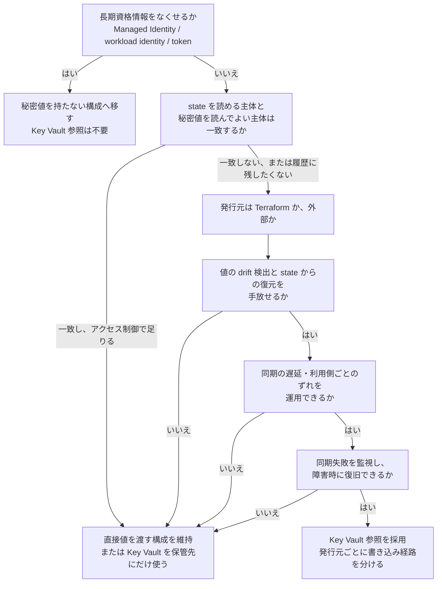
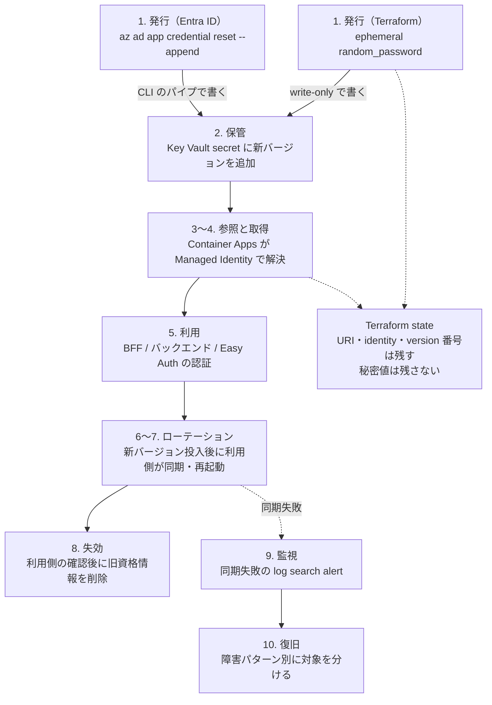
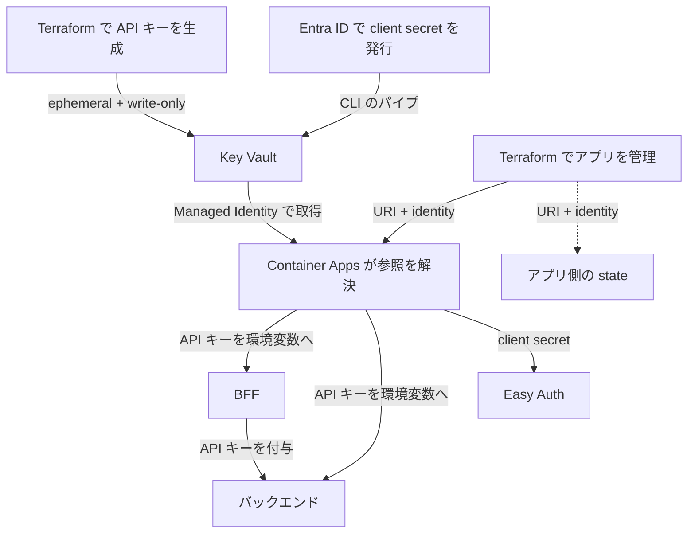

API キーやクライアントシークレットを Secret に入れても、その値を Terraform に渡していれば state に残ることがあります。`sensitive = true` は CLI の表示を伏せるだけで、保存される場所が減るわけではありません。

Azure Container Apps で動かしている個人開発のチャットアプリで、アプリ間の API キーと、サインインに使うクライアントシークレットを Azure Key Vault 参照へ移し、最新の state に値を残さない構成にしました。

ただし、state から値を外せば終わりではありませんでした。Terraform が state を通じて担っていた「値の保持・変更検知・配布・復旧」の一部を手放すことになり、その代わりに Key Vault 上の値と利用側の同期、同期失敗の監視、ローテーション（secret rotation）の順序、障害時の復旧を別に設計する必要が生まれました。

この記事は Key Vault 参照を推奨する記事ではありません。**何を得て、何を失い、どの運用を引き受けるのか**を整理し、読者が自分の環境で採用するかを判断できるようにすることが目的です。同時に、実装・検証・失敗の記録を、後から復習できる粒度で残しています。

対象読者は、Terraform でアプリへ秘密値を渡していて、「Secret 管理サービスに集約すれば十分か」「state からも外すべきか」を判断したい人です。

:::message
対象は個人で運用する `dev` 環境です。2026-09-22 の事前検証から、10-03 のクライアントシークレット移行までの実施記録をもとにしています。利用者は所有者本人で、計画的な更新中の認証失敗や再起動を許容しています。無停止のローテーションを実証した記事ではありません。

対象構成は Terraform 1.14.8、AzureRM provider 5.1.0、random provider 3.9.1 です。公式仕様と provider 実装は 2026-10-03〜10-04 に確認しました。
:::

## 先に結論

採用したのは、**秘密値を Key Vault に保管し、Container Apps には値ではなく参照を渡す**構成です。API キーは Terraform で生成し、クライアントシークレットは Terraform の外で発行します。発行経路を分けたうえで、どちらも最新の state に値を保存しない形にしました。

Key Vault 参照は、直接値を渡す構成の上位互換ではありません。state に値を置かないことで得るものと、代わりに引き受けるものは次のとおりです。

| 観点 | 直接値を渡す構成 | Key Vault 参照（今回） |
| --- | --- | --- |
| 値の保持 | Terraform state が保持する | Key Vault が保持し、state には URI と identity だけが残る |
| 値の変更検知 | state との比較で drift を検出・修復できる | 値そのものの drift は検出できない。更新は version 番号で指示する |
| 利用側への配布 | apply が値を配布し、反映時点が明確 | Container Apps が定期同期で取得する。反映時点は利用側ごとにずれる |
| 復旧 | state から同じ値を復元できる | Key Vault 側の復元か、再発行と再同期に依存する |
| 増える運用 | state のアクセス制限と履歴管理 | 同期失敗の監視、ローテーションの順序、取得経路障害時の復旧手順 |

判断の核は3つです。

1. **誰が秘密値を発行・更新するか**で供給経路を選び、生成・書き込み・読み出しのどこにも state への保存経路を作らない。
2. **新しい値が利用側で使われたこと**を切り替えの完了条件にし、旧資格情報を無効にする順序を決める。
3. **値の変更検知・更新の遅延・再起動・復旧**まで含めて、state に値を保存しない構成を運用できるか判断する。

最終的な判断基準は、**「state に秘密値を置かない価値」が「drift 検出を手放し、同期・監視・復旧を別に運用するコスト」を上回るかどうか**です。

今回の到達点は、対象の2つの秘密値を最新の state から外し、新しい値でサインインとチャットが使えることを確認したところです。過去の state の内容を消す操作と、複数アプリを同時に更新する仕組みは含みません。

## 採用するかどうかを決める順序

読者が自分の環境へ当てはめられるように、判断の順序を先に示します。以降の章は、この順序の各項目に対応する根拠と実装です。



### 1. 長期資格情報そのものをなくせないか

保管場所を選ぶ前に、秘密値を持たなくて済む方式がないかを確認します。Managed Identity、workload identity、トークンベースの認証へ移せる接続なら、Key Vault 参照も state の問題も発生しません。今回の環境では DB と Azure OpenAI をこの方式に移し、API キーと Easy Auth のクライアントシークレットが残りました。その理由は「認証方式ではなく、秘密値の供給経路を見直した」で説明します。

### 2. 長期資格情報を残すなら、state から外す必要があるか

秘密値を state に保存すること自体が、すべての環境で禁止されるわけではありません。state を読める主体と、秘密値を読んでよい主体が事実上同じで、state backend のアクセス制御・暗号化・監査で管理できるなら、state から外して得るものは小さくなります。state を読む CI やバックアップの管理者に秘密値まで読ませてよいか、その権限をそれ以上絞れるか、履歴に今後の秘密値を蓄積させてよいかで判断します。

### 3. 秘密値を誰が発行するか

Terraform 自身が生成する値と、Terraform の外で発行される値では、state に値を残さない経路が異なります。前者は ephemeral resource と write-only argument の組み合わせ、後者は Terraform を経由させない投入が候補です。Entra ID のクライアントシークレットのように発行元が Terraform の管理外にある値は、発行から保管までの経路を別に設計します。

### 4. state から値を外すことで失うものを許容できるか

state に値がないと、次のことができなくなるか弱くなります。

- state から同じ秘密値を復元すること
- 値そのものに対する Terraform の drift 検出と修復
- Terraform を秘密値の唯一の source of truth として扱うこと

秘密値の実体は Key Vault 側で管理され、Terraform が持つのは構成情報だけになります。これらを手放せないなら、この時点で直接値の構成を維持する判断になります。

### 5. Key Vault 参照の同期特性を運用できるか

Key Vault 上の値を書き換えた瞬間に、すべての利用側が切り替わるわけではありません。利用側ごとに取得タイミングがずれ、revision の再起動と secret の同期は同義ではなく、一時的に旧値が使われる期間が生まれます。複数の利用側が同じ値を共有するなら、更新中の不一致をどう扱うかを決める必要があります。

### 6. 同期失敗を監視できるか

アプリケーションが現在正常に動いていることと、次回も Key Vault から値を取得できることは別です。取得済みの値で動き続ける間に権限や secret の状態が壊れていても、死活監視では検知できません。同期失敗を検知する手段を用意できるかを確認します。

### 7. 障害時・ローテーション時に復旧できるか

同じ値を復元するのか新しい値を再発行するのか、Key Vault 参照を一時的に外して直接値で復旧するのか、その間に Terraform を実行すると state へ秘密値が再混入しないか、緊急時の手動復旧手順を用意するかを決めます。

## 今回の成功条件

実装と検証に入る前に、何を確認できれば移行できたと判断するかを決めました。各条件に対する実際の結果は「実際の検証結果」にまとめています。

| 成功条件 | 確認方法（計画） | 対応する章 |
| --- | --- | --- |
| 最新の Terraform state に対象の secret 値が存在しない | 生成側・アプリ側の state を直接確認する。plan の差分なしだけを根拠にしない | 実装 |
| 新しい secret を使って実際の機能が成功する | API キーは BFF とバックエンドの値の一致とチャットの成功。クライアントシークレットは cookie のない状態での新規サインイン成功 | ローテーション |
| Key Vault で secret が更新されたあと、利用側が新しい値へ追従する | 環境変数経由と Easy Auth 経由の両方で、新バージョンへの同期と再起動を確認する | 自動更新と同期 |
| Key Vault からの secret 同期失敗を監視・検知できる | 同期失敗を意図的に起こし、アラートの発火と通知の受信を確認する | 監視 |
| 取得経路の障害時に、Key Vault を迂回して復旧できる | 直接値の構成へ切り替えて動作を確認し、参照へ戻せることを確認する | 復旧 |

## 誰が、何のために秘密値を使っていたか

ブラウザからのリクエストは、フロントエンドのサーバー処理を経由してバックエンドに届きます。この中継処理を BFF（Backend for Frontend）と呼びます。

サインインには Container Apps の組み込み認証機能である Easy Auth を使います。アプリに付随する認証用コンテナ（sidecar）が Microsoft Entra ID とやり取りし、認可コードをトークンへ交換するときにクライアントシークレットを使います。[Microsoft Learn の Entra ID 認証設定](https://learn.microsoft.com/en-us/azure/container-apps/authentication-entra)

| 秘密値 | 利用者と用途 | 移行前の供給経路 | 不一致・失効時の影響 |
| --- | --- | --- | --- |
| API キー | BFF が付与し、バックエンドが照合。ブラウザへは渡さない | 通常の `random_password` resource → Container Apps の `secret.value` | チャット要求が認証エラーになる |
| クライアントシークレット | Easy Auth が Entra ID に対してアプリを認証する | Entra ID で発行 → tfvars → `secret.value` | 新規サインイン時のトークン交換が失敗する |

| 観点 | 今回の前提 |
| --- | --- |
| 実行者 | 所有者本人がローカルで Terraform と Azure CLI を操作 |
| 対象 | BFF とバックエンドの2つの Container App、および BFF 側の Easy Auth |
| 権限境界 | アプリの取得用 identity と、秘密値を書き込む所有者の権限を分ける。ロール割り当てと Entra ID の資格情報の発行は所有者が Terraform の外で管理 |
| 成功条件 | 対象値が最新の state に残らず、新しい値でサインインとチャットができる |

**state** は Terraform がリソースの状態を保存するデータです。値を含む場合は、state を読める主体にもその秘密値が見えます。

解きたかった課題は、**インフラ管理のために保存する state に、利用可能な秘密値を残し続けること**でした。アプリ管理者による秘密値の取得をすべて防ぐ設計ではありません。

たとえば、state を読む CI やバックアップの管理者に、アプリの秘密値まで読ませてよいかを確認します。許可できない主体が含まれ、state の権限をそれ以上絞れないなら、値を保存しない利点があります。今回は所有者中心の運用でしたが、今後の state の履歴にも秘密値を蓄積させないことを目的にしました。

ただし、Container Apps の `Microsoft.App/containerApps/listSecrets/action` は秘密値を平文で返す権限です。`Container Apps Contributor` や `Container Apps Operator` にもワイルドカード経由で含まれます。参照方式を採っても、アプリ側で秘密値を取得できる主体の権限管理は必要です。[Microsoft Learn の secret 管理権限](https://learn.microsoft.com/en-us/azure/container-apps/manage-secrets#permissions-for-managing-secrets)

## 認証方式ではなく、秘密値の供給経路を見直した

先に、DB と Azure OpenAI への認証を Managed Identity に移しました。Managed Identity は、アプリが自前の長期資格情報を持たずに Microsoft Entra ID のトークンを取得できる仕組みです。

一方、BFF とバックエンドの間には API キーの照合を残しました。バックエンドを誤って外部公開する設定に戻しても、匿名の要求で LLM の課金を発生させないための第二の防御です。サービス間のトークン認証に置き換える案もありますが、今回はキーの供給経路の変更に絞りました。

Easy Auth も、クライアントシークレットを使う認証構成を維持しました。この段階では、対象 provider の Container Apps secret に write-only の引数がなく、直接渡した値が state に残ることを受け入れていました。

後から見直したのは、**長期資格情報を残す判断と、その値を state に保存する判断は別にできる**という点です。前者はアプリの認証方式の選択で、後者は秘密値の供給経路の選択です。既存の認証方式を変えなくても、Container Apps に Key Vault から取得させる経路を選べました。長期資格情報をなくせなかったから失敗だったのではなく、2つの判断を分離して後者だけを変えたというのが今回の位置づけです。

## 方式比較：何を得て、何を失い、どの運用が増えるか

比較の条件は「既存の API キー認証と Easy Auth の認証構成を維持する」です。

ネットワークは、**Key Vault の公開エンドポイントを使い、ファイアウォールや private endpoint による制限を設けない構成**が前提です。アクセスは Entra ID の認証と Azure RBAC で制御します。ネットワークを制限した環境では、投入・読み取りを行う Terraform / Azure CLI の実行端末に加え、参照方式では Container Apps からも Key Vault に到達できることが採用条件になります。

制限された環境での名前解決・通信経路・許可設定と、参照の初回取得・更新時の同期は今回未検証です。権限の付与だけで利用可能とは判断せず、これらを確認してから比較表を適用します。[Key Vault のネットワーク制御](https://learn.microsoft.com/en-us/azure/key-vault/general/network-security)

比較する3つの構成は次のとおりです。

- **構成 A**: Terraform で通常の resource や変数として値を扱い、Container Apps に直接渡す
- **構成 B**: Key Vault の値を Terraform の secret data source で読み、Container Apps にシークレットの値を直接指定する
- **構成 C**: state に値を保存しない経路で Key Vault に書き、Container Apps が参照する（採用）

評価軸は、state と変更検知に関するもの、更新と同期に関するもの、障害と運用に関するものの3群に分けました。

| 構成 | 最新の state に値が残るか | 値そのものの drift 検出 | 発行・更新の主体 | 利用側への反映 |
| --- | --- | --- | --- | --- |
| A | 残る | 可能（state と比較） | Terraform | apply が値を配布 |
| B | 残る（data source の読み取り値） | 可能（読み取り値と比較） | Key Vault の更新に加え、Terraform 経由の反映 | apply が値を配布 |
| C | 対象値を保存しない | 不可。削除や version の変化は検出できる | 発行側が Key Vault に新バージョンを投入 | Container Apps が定期同期で自動追従 |

| 構成 | 利用側の同期 | ローテーション時に考えること | 障害時に扱うもの | 追加で必要な運用 |
| --- | --- | --- | --- | --- |
| A | 不要（apply で確定） | Terraform 経由で新しい値をアプリへ反映し、再起動する | アプリに保持した値と再起動 | state のアクセス制限・履歴管理 |
| B | 不要（apply で確定） | Key Vault を更新してから Terraform を再実行する | Key Vault の取得とアプリへの注入 | Key Vault の権限・state の保護 |
| C | 必要。利用側ごとに反映時点がずれる | 新旧の併存、利用側の切り替え確認、旧資格情報の失効順序 | 参照の同期・取得済みの値・再起動・取得経路 | Key Vault の権限・同期失敗の監視・復旧手順・Terraform 再混入の防止 |

採用したのは構成 C です。最新の state から対象値を外すことを成功条件にしたため、A・B では達成できません。C の書き込み経路は、秘密値の発行元に応じて分けます。

ただし、保管先の集約が目的で、state を秘密情報として保護する運用を受け入れるなら、B にも用途があります。A を続ける場合も、state へのアクセスを制限することは有効です。どちらも「state に値がない」という性質とは区別します。逆に、C は値の drift 検出と apply 時点の配布確定を手放しているため、A・B より安全性が高い方式と位置づけることはできません。

採用案では Key Vault の操作、ログ取り込み、アラートの費用と管理対象が増えます。今回の記録では月額の増分は未集計です。費用削減を成果とはせず、秘密値の保存先を減らすための運用コストとして受け入れました。

## 秘密値のライフサイクル

採用した構成では、秘密値の発行から失効・復旧までに次の段階があります。Terraform が関わる範囲と、Key Vault・Container Apps・運用手順が担う範囲を分けて示します。



発行経路は2つあります。Terraform 自身が生成する値（API キー）は、ephemeral resource と write-only argument で Key Vault へ書き、state には更新を指示する version 番号だけが残ります。Terraform の外で発行される値（クライアントシークレット）は、Azure CLI の出力を直接 Key Vault へ渡し、Terraform を経由させません。

いずれの経路でも、Terraform state には参照先の URI と identity、version 番号といった構成情報が残り、対象の秘密値そのものは残りません。一方、ローテーション以降の段階（同期の確認、旧資格情報の失効、監視、復旧）は Terraform の apply では完結せず、運用手順として設計する必要があります。これが「先に結論」で示したトレードオフの実体です。

## 実装：発行元に応じて、state に値を保存しない経路を選ぶ

今回の2つの秘密値は、更新の責任を持つ場所が違います。

| 対象 | 発行・更新する場所 | Key Vault への投入 | アプリへの供給 |
| --- | --- | --- | --- |
| API キー | Terraform | ephemeral resource で生成し、write-only argument で書く | Container Apps が参照を解決し、環境変数へ渡す |
| クライアントシークレット | 所有者が操作する Entra ID | Azure CLI の出力を直接パイプし、Terraform へ渡さずに書く | Container Apps が参照を解決し、Easy Auth が使う |



### Terraform で発行する値は、生成側と書き込み側をそろえる

Terraform の機能は、次のように役割が違います。

| 機能 | 役割 |
| --- | --- |
| `sensitive` | 通常の CLI 出力などで値を伏せる。state や保存した plan への格納は防がない |
| ephemeral resource | 実行中だけ使う値を生成・取得し、state や plan に保存しない |
| write-only argument | provider に値を渡すが、その引数の値を state や plan に保存しない |

**仕様**: ephemeral resource は Terraform 1.10 以降、write-only argument は 1.11 以降の機能です。加えて、利用する provider が該当の resource・引数に対応している必要があります。[HashiCorp の機密データ管理](https://developer.hashicorp.com/terraform/language/manage-sensitive-data)と[ephemeral resource の説明](https://developer.hashicorp.com/terraform/language/manage-sensitive-data/ephemeral)で区別されています。

値を保存しない代わりに、次の2つを手放します。

- **秘密値そのものの比較による drift 検出・修復**。drift は設定と実環境のずれです。write-only の値には state 上の比較対象がないため、Key Vault 側の値を意図した値と比較して戻すことはできません。後述の `value_wo_version` は更新を指示する番号であり、値の一致を検査するものではありません。HashiCorp の公式ドキュメントにも、write-only argument は plan の差分を作れず、代わりに version argument の変化を追跡すると書かれています。[HashiCorp の write-only の更新仕様](https://developer.hashicorp.com/terraform/language/manage-sensitive-data/write-only#update-write-only-arguments-with-versions)
- **state から同じ秘密値を復元すること**。今回の ephemeral `random_password` は再生成すると別の値になります。元の値が必要なら Key Vault 側で復元できるようにし、新しい値でよければ発行と利用側への再反映を復旧手順にします。

**仕様（provider 実装）**: ただし、**secret 自体の削除検出まで失うわけではありません**。AzureRM 5.1.0 の実装では、refresh（実環境の状態の再取得）で secret の取得結果が 404 なら、再作成の対象になります。バージョンなどのメタデータも読み取るため、「値の比較ができない」と「plan に何も出ない」は区別します。[AzureRM 5.1.0 の読み取り実装](https://github.com/hashicorp/terraform-provider-azurerm/blob/v5.1.0/internal/services/keyvault/key_vault_secret_resource.go)

**設計判断**: **秘密値の drift を Terraform の plan だけで検出・修復することが必須なら、この write-only の構成は選びません。** 採る場合は、値を更新できる主体の制限、更新操作の監査、利用側の動作確認を別に設計します。同期成功だけでは、その値が意図した値かまでは判断できません。

このプロジェクトでは、Key Vault と Container Apps を別の root module・state で管理しています。root module は、ここでは Terraform を実行する設定ディレクトリです。以下の「Key Vault 側」「アプリ側」はこの実行単位を指します。

次は実装の要点です。参照名は説明用に整理し、Key Vault 本体や変数の定義は省略しています。

```hcl
ephemeral "random_password" "chat_api_key" {
  length  = 64
  special = false
}

resource "azurerm_key_vault_secret" "chat_api_key" {
  name             = "chat-api-key"
  key_vault_id     = azurerm_key_vault.main.id
  value_wo         = ephemeral.random_password.chat_api_key.result
  value_wo_version = var.chat_api_key_version
}
```

ephemeral の値は保存できないため、通常の保存される引数へは渡せません。受け取る側も `value_wo` にします。通常の値を Key Vault の `value` に渡す構成では、書き込み側の state に値が残ります。

`value_wo_version` は、値を保存せずに更新を指示するための番号です。Key Vault が発行するバージョン ID とは異なります。今回のキー更新は `chat_api_key_version` を増やし、**Key Vault を管理する側で Terraform apply する**運用です。Container Apps を管理する側の apply は不要になります。

つまり、Terraform が秘密値を扱わなくなるわけではありません。実行中には生成・送信しますが、値の永続化を避けます。[AzureRM 5.1.0 の Key Vault Secret 定義](https://github.com/hashicorp/terraform-provider-azurerm/blob/v5.1.0/website/docs/r/key_vault_secret.html.markdown)に対応する引数があります。

### 外で発行する値は、Terraform を経由させずに投入する

クライアントシークレットは、所有者が Entra ID で発行し、Azure CLI の出力を `az keyvault secret set` の標準入力へ直接渡しました。今回の投入では値を画面やファイルへ出さず、tfvars や Terraform の変数にも渡していません。新旧の資格情報を併存させるため、発行には `az ad app credential reset --append` を使います。`--append` を省くと既存の資格情報をすべて消す動作になるため、更新の順序に関わる指定です。[Azure CLI の credential reset](https://learn.microsoft.com/en-us/cli/azure/ad/app/credential?view=azure-cli-latest#az-ad-app-credential-reset)

ここで既存の tfvars の値を Key Vault へコピーする案もあります。しかし、同じ値を使い続けると過去の state に残った値も有効なままです。今回は新しい値を発行して切り替え、動作確認後に旧資格情報を削除する方針にしました。

この経路を選んだ理由は、今回の運用では Entra ID の資格情報の発行を Terraform の管理外に置いているためです。発行元も Terraform で管理する環境なら、利用する provider の対応を確認し、発行から書き込みまで値を保存しない経路を組めるかで判断します。

### 参照を設定するために、秘密値そのものを読み出さない

Container Apps には、Key Vault の URI と、それを取得する identity を渡します。両アプリの `secret` block を次の形にしました。

```hcl
locals {
  chat_api_key_secret_id = "${data.azurerm_key_vault.main.vault_uri}secrets/chat-api-key"
}

# azurerm_container_app 内の抜粋。identity はアプリへ割り当て済み。
secret {
  name                = "chat-api-key"
  key_vault_secret_id = local.chat_api_key_secret_id
  identity            = data.azurerm_user_assigned_identity.app.id
}
```

`data.azurerm_key_vault.main` で読むのは Vault のメタデータです。secret の値を取得する `data "azurerm_key_vault_secret"` を使うと、読み出した値が state に入るため使いません。参照だけが必要なら、値を取得せず URI を組み立てます。[AzureRM の secret data source の注意事項](https://github.com/hashicorp/terraform-provider-azurerm/blob/v5.1.0/website/docs/d/key_vault_secret.html.markdown)にも、取得した値が state に保存されることが明記されています。

アプリの identity には対象 Vault の `Key Vault Secrets User`、書き込む所有者には `Key Vault Secrets Officer` を付けました。前者は値の読み取り、後者は secret の管理に使う権限です。実装では既存の identity を共用しており、アプリごとの権限分離まで完了したわけではありません。

Easy Auth も同じ `key_vault_secret_id` と `identity` の形にし、`value = var.easy_auth_client_secret` を削除しました。Key Vault から値を取得する Managed Identity と、取得したクライアントシークレットで Entra ID にアプリを認証する Easy Auth は、役割が別です。

また、必要な secret が投入されているかを plan 時に確認するため、複数形の `data "azurerm_key_vault_secrets"` で名前の一覧を読み、precondition で存在を検査します。この data source が返すのは名前・ID などのメタデータで、秘密値ではありません。ただし、名前があることと、その資格情報でサインインできることは別の確認です。[AzureRM 5.1.0 の secret 一覧 data source](https://github.com/hashicorp/terraform-provider-azurerm/blob/v5.1.0/website/docs/d/key_vault_secrets.html.markdown)

## 切り替えで分かったこと

事前検証と移行で得た知見を、見出しに先に出します。各見出しの本文は、何をしたか・何が起きたか・なぜそう考えたか・運用をどう変えたかの順で残しています。

### 学び：Key Vault を書き換えた時点では切り替え完了ではない

**今回の実測（2026-09-22）**: 事前検証で、Key Vault に新しいクライアントシークレットを投入した直後に Entra ID の旧資格情報を削除しました。すると Easy Auth はまだ旧値を使っており、`AADSTS7000215: Invalid client secret provided` でサインインが失敗しました。その後の自動同期と再起動を経て、新規サインインが成功しています。

Key Vault 上の値は新しくなっていても、利用側の sidecar は取得済みの旧値で Entra ID に認証しに行きます。発行元で旧資格情報を失効させるのが早すぎると、新値への同期が終わるまで認証が失敗する期間ができます。

**設計判断**: この結果から、旧資格情報の削除は「利用側が新しい値で認証に成功したことを確認した後」に固定しました。手順の詳細は「ローテーション：切り替え完了条件と順序」に書いています。

### 学び：切り替え完了は、利用側の認証成功と旧 replica の停止で判断する

参照の設定が apply できても、利用側が新しい値を使ったとは限りません。API キーなら BFF とバックエンドの値の一致に加え、チャットの成功を確認します。Easy Auth なら、既存のセッション cookie がない状態でサインインし、sidecar が新しい資格情報でトークンを取得できたことを確認します。

**今回の実測（2026-10-03）**: サインイン済みのタブを再読み込みするだけでは、この確認になりません。既存の cookie があるとサインインのトークン交換が再実行されず、新しいクライアントシークレットが使われたかを判定できないためです。クライアントシークレットの切り替えでは、新しいシークレットウィンドウからサインインし、sidecar の token POST が 200、続いて `LoginComplete` になることを確認しました。Key Vault とアプリが保持する値の一致も確認し、初めてアプリへ渡した新しい値で認証できたと判断しています。

同じ 10-03 の切り替えでは新しい revision は作られませんでしたが、replica は入れ替わりました。revision はデプロイ単位、replica はそれを動かす実行インスタンスです。新 replica の作成時刻は同期ログより先だったため、「同期時刻より新しい replica がある」ことを条件にはできません。revision 数や「同期成功」のログだけで、旧値を使うインスタンスがなくなったとは判断しません。

**設計判断**: 更新前の replica を記録しておき、その停止と他の replica の稼働まで確認する条件を運用手順に入れました。

### 学び：revision の再起動だけでは最新の secret になる保証はない

**今回の実測（2026-10-01）**: 検証用の secret に新バージョンを作り、手動で revision を再起動しました。しかし、コンテナには旧値が渡されました。再起動が定期同期と重なった可能性を除外したうえで、platform 側と新しいコンテナの両方が旧バージョンを保持していることを確認しています。その後の定期同期では新値に変わりました。

Microsoft Learn には versionless URI の新バージョンを 30 分以内に取得すると書かれていますが、手動の再起動が即時の再取得を引き起こすとは書かれていません。この実測は、再起動と同期が別の処理であることを示しています。

**設計判断**: 復旧手順では「再起動すれば最新になる」を前提にせず、原因を解消して参照を設定し直し、取得した値の一致を確認する順にしました。

### 学び：アプリが正常でも、次回の secret 取得が成功するとは限らない

**今回の実測（2026-09-22）**: 一度 secret を取得した後、identity から Key Vault の読み取りロールを外しました。すると定期同期は次の理由で失敗しましたが、アプリは取得済みの値で動き続けました。

```text
SyncingSecretFromAzureKeyVaultForContainerAppFailed
```

これは今回の検証で観測した動作です。権限を外してもいつまでも動く、あるいは再起動しても必ず動くという保証には使えません。取得済みの値の保持期間や、再起動後に取得できない場合の挙動は未検証です。

**設計判断**: 死活監視やチャットの成功確認だけでは、「次の値を取得できるか」を確認できないと判断しました。これが同期失敗の監視を置く根拠です。詳細は「監視：正常稼働の確認だけでは不十分」に書いています。

### 学び：複数の利用側が同じ瞬間に新値へ切り替わるとは限らない

API キーは BFF とバックエンドが共有しています。一方だけが新しい値になれば、不一致の間は認証エラーになり得ます。30 分以内の自動取得という仕様から、複数アプリの同時切り替えまでは導けません。

**今回の実測（2026-10-01）**: 実アプリの試験では、Key Vault 側の apply 完了から約 21 分後に両アプリが新バージョンを同期し、revision が再起動しました。更新後のチャットも成功しています。新旧のコンテナが混在するログは残っていますが、更新中にチャット要求を流す試験はしていないため、認証エラーが起きなかったとも、無停止だったとも言えません。

**設計判断**: 更新中の認証失敗を許容できる `dev` 環境のため、単一の API キーを置き換える方式のままにしました。許容できない環境での選択肢は「ローテーション：切り替え完了条件と順序」で扱います。

## 自動更新と同期：仕様・実測・設計判断

**仕様**: Container Apps の secret は revision ではなくアプリに属し、secret を更新・削除しても既存の revision には自動で影響しません。Key Vault 参照の URI にバージョンを付けない場合、Microsoft Learn では、新しいバージョンを 30 分以内に取得し、該当 secret を**環境変数で**使う active revision を自動的に再起動すると説明されています。[Container Apps の secret URI と更新仕様](https://learn.microsoft.com/en-us/azure/container-apps/manage-secrets#key-vault-secret-uri-and-secret-rotation)

公式仕様に書かれていないのは、複数アプリの同時切り替え、手動再起動による即時の再取得、取得済みの値の保持期間です。これらは「今回の実測」でしか語れません。

**今回の実測**: Easy Auth は環境変数ではなく `clientSecretSettingName` で secret を参照します。この経路でも自動追従と再起動が起きることは、09-22 の検証で確認しました。公式に書かれた範囲（環境変数参照）と、この環境で確かめた範囲（Easy Auth 参照）を分けて採用の根拠にしています。

**設計判断**: 参照 URI にはバージョンを付けませんでした。バージョンを固定すれば採用する値を明示できますが、更新のたびに参照先を変える apply が必要です。今回はその操作を減らすために自動追従を選び、代わりに同期の遅延と同期失敗の監視を引き受けました。URI のバージョン固定を選んでも、共有キーを複数アプリで同時に切り替える問題は解消しません。

## ローテーション：切り替え完了条件と順序

### 切り替え完了の条件

「Key Vault へ新しい値を書いた」「revision が再起動した」だけでは、切り替え完了とは判断しません。今回は次をすべて満たしたときに完了としました。

1. Key Vault の最新バージョンと、アプリが保持する値が一致している。
2. 更新前に記録した replica が停止し、他の replica が稼働している。
3. 利用側が新しい値で実際の認証に成功している。API キーならチャットの成功、クライアントシークレットなら cookie のない状態での新規サインイン成功（token POST 200 と `LoginComplete`）。

### Entra ID のクライアントシークレットは、新値の確認後に旧資格情報を削除する

順序を決める根拠は、「学び：Key Vault を書き換えた時点では切り替え完了ではない」の `AADSTS7000215` の失敗です。移行では次の順序にしました。

1. 旧資格情報を残して新しい値を発行し（`--append`）、Key Vault へ投入する。
2. 参照へ切り替え、同期成功と値の一致、旧 replica の停止と新 replica の稼働を確認する。
3. 既存の cookie がない状態でサインインし、トークン交換とチャットの成功を確認する。
4. 旧資格情報を削除し、再び新規サインインとチャットを確認する。

2026-10-03 の切り替えでは、この順序で旧資格情報の削除後も新規サインインとチャットが成功しました。

### 過去の state に残った値は、別に失効させる

state の保存先ではバージョニングが有効なため、移行前の state には古い値が残ります。**最新の state から値を外すことと、過去の state に残った資格情報を無効にすることは別**です。クライアントシークレットは発行元で旧資格情報を削除し、API キーは両アプリが使う値を更新しました。履歴を消したわけではないため、state へのアクセス制限は継続します。

### 複数の利用側で無停止が必要なら、別のローテーション設計になる

「学び：複数の利用側が同じ瞬間に新値へ切り替わるとは限らない」のとおり、BFF とバックエンドの同期は同時ではありません。**更新中も要求を成功させる必要があるなら、ここで判断が変わります。**

単一の secret を一気に置き換える方式ではなく、たとえばバックエンドで新旧2つのキーを受理できるようにし、呼び出し側を新キーへ移して確認した後に旧キーを失効させる方式になります。これは今回未実装の選択肢で、バックエンドの認証処理の拡張を伴う別の設計変更です。

Easy Auth では Entra ID に新旧の資格情報を併存させられますが、今回のバックエンドは1つの API キーだけを受理します。同じ Key Vault 参照でも、利用側が新旧の値を受け入れられるかによって更新手順が変わります。また、新旧を併存させても replica の再起動はあるため、それだけで無停止を保証するものではありません。この記事が扱うのは、更新中の認証失敗を許容できる環境の手順までです。

## 監視：正常稼働の確認だけでは不十分

根拠は「学び：アプリが正常でも、次回の secret 取得が成功するとは限らない」です。Key Vault の読み取り権限を失っても、アプリは取得済みの値で動き続けました。この状態で次のローテーションや再起動が起きると、新しい値を取得できない可能性があります。死活監視と機能確認は「今の値で動いている」ことしか示さず、「次も取得できる」ことは示しません。

同じ性質の障害として想定しているのは、identity からのロール割り当ての削除（今回実測）、Key Vault 側の secret の無効化・削除（10-01 のアラート試験では無効化で同期失敗を再現）、ネットワーク制限の変更による到達不能（未検証）です。いずれも同期の失敗として現れ、取得済みの値で動いている間はアプリの応答からは分かりません。

そこで、Container Apps のシステムログを Azure Monitor の log search alert（ログの条件を評価するアラート）で監視しています。主要部分は次の KQL です。

```kusto
ContainerAppSystemLogs_CL
| where Reason_s == "SyncingSecretFromAzureKeyVaultForContainerAppFailed"
| summarize FailedCount = count() by ContainerAppName_s
```

今回は直近1時間を 15 分ごとに評価し、アプリごとの件数が0を超えたら所有者へ通知します。これはこの環境で採用した設定であり、失敗から 15 分以内に通知される保証ではありません。定期同期、ログ取り込み、アラート評価、通知配送がそれぞれ必要です。

受信後は対象アプリを特定し、secret の有効状態と identity の読み取り権限を確認します。復旧後は同期成功に加え、対象の秘密値を使うサインインやチャットの動作を確認します。

## 復旧：何が壊れたかで復旧対象を分ける

障害ごとに復旧する対象が違います。今回想定したパターンと検証状況は次のとおりです。

| 障害 | 復旧対象 | 今回の手順 | 検証状況 |
| --- | --- | --- | --- |
| Key Vault 内の値の消失 | secret そのもの | soft-delete からの復元、または再発行と再同期 | 設定の確認のみ。復元の演習は今回の記録に含まない |
| Key Vault 参照・権限の障害 | 取得経路 | 直接値の構成へ一時的に切り替え、参照へ戻す | API キーで 09-28 に往復を検証。Easy Auth 固有の操作は未演習 |
| 利用側の同期失敗 | 利用側の同期 | 原因を解消し、参照を設定し直して値の一致を確認 | 10-01 の再起動試験で順序を決定 |
| 資格情報の失効順序の誤り | 新資格情報の再発行と再同期 | 旧資格情報を残して再発行し、同期と認証成功を待つ | 09-22 の `AADSTS7000215` から順序を確定 |

### 値を失った場合に、同じ値へ戻す必要があるか

**仕様**: Key Vault の secret を誤削除した場合、soft-delete（論理削除）は保持期間内の復元に使えます。purge protection は、その期間が終わる前の完全削除を防ぎます。これらが守るのは削除からの復旧であり、誤った値への更新を取り消す機能ではありません。[Microsoft Learn の soft-delete と purge protection](https://learn.microsoft.com/en-us/azure/key-vault/general/soft-delete-overview)

**設計判断**: 今回の `dev` 環境は soft-delete の保持が7日、purge protection は無効で、Terraform の destroy 時には完全削除する設定です。同名での作り直しと、API キーの再生成・クライアントシークレットの再発行を選べることを優先しました。**この設定では、destroy 後に同じ秘密値へ戻す要件を満たせません。** 同じ値の復元が必要な環境では、削除保護と保持期間、必要なバージョンの保全、復旧権限・手順を決めて検証することが採用条件になります。

### 取得経路の障害時に、シークレットの値を直接指定して復旧できるか

Key Vault の読み取りが原因で切り替えに失敗した場合、復旧のために同じ Key Vault を読みに行く手順では戻せません。

**今回の実測（2026-09-28）**: API キーでは、切り替え前に両アプリへ設定する同一のキーを作業端末へ一時退避しました。所有者だけが読める権限で保管し、Azure CLI で次の往復を検証しています。

```text
Key Vault 参照
  → 退避した同じ値を、両アプリのシークレットに直接指定
  → revision を再起動し、チャットの動作を確認
  → Key Vault の参照に戻し、同期と値の一致を確認
  → 一時退避した値を削除
```

これは Key Vault の取得経路を迂回するための一時退避です。秘密値の保管場所が一時的に増えるため、退避データへのアクセス制限と削除までを手順に含めます。

Key Vault 参照に戻した直後について、今回の記録で確認できるのは同期と値の一致までです。運用手順として採るなら、Key Vault 参照に戻した後のチャット確認も退避データを削除する条件に加えます。

Easy Auth では、Key Vault が読めなくても Entra ID で復旧用の資格情報を新規発行できる前提で、ARM API の PATCH によりシークレットの値を直接指定して復旧する手順を用意しました。既定の secret 名が Azure CLI の文字数制限に当たるため、CLI ではなく ARM API を使います。Key Vault 参照を使う構成と、シークレットの値を直接指定する構成の切り替えは API キーで検証済みですが、この Easy Auth 固有の操作手順は実機演習していません。自分の環境で採用する際も、**復旧用の値をどこから確保するかと、対象の secret をどう書き換えるか**を確認する必要があります。

### 直接値で復旧している間は、Terraform を実行しない

ここで重要なのは、**シークレットの値を直接指定している間は、Container Apps 側の Terraform を plan を含めて実行しない**ことです。対象 provider が直接指定したシークレットの値を読み取ると、state や保存した plan に値が再び入る経路を作るためです。state から値を外した構成でも、復旧手順しだいで再混入します。

CI など別の実行者が同じ state を扱う環境なら、そちらも止める必要があります。Key Vault とアプリを1つの state で管理するなら、その実行単位全体が停止対象です。参照に復帰したことを確認してから Terraform の実行を再開し、最終的な差分を確認します。

## 実際の検証結果

「今回の成功条件」に対応する結果です。事前検証で参照方式の振る舞いを確認し、各移行では対象の値が届いて実際に使えることを確認しました。Easy Auth の移行では、09-22 の自動追従試験に加え、09-28 にシークレットの値を直接指定してから Key Vault 参照へ戻せたことを根拠として引き継ぎ、新規発行した値での認証と旧資格情報の削除を追加確認しています。

| 成功条件 | 何を確認したか | どう確認したか | 確認できた範囲 | 未確認の範囲 |
| --- | --- | --- | --- | --- |
| 最新の state に対象値を保存しない | 対象の2つの秘密値が state に無いこと | API キーは生成側・アプリ側の state を直接確認。旧 `random_password` resource と output の消失、`secret.value` の長さ0を確認。client secret は事前検証済みの参照方式へ切り替え、値を渡す変数を削除 | 対象の2つの秘密値 | 10-03 時点での raw state の再照合は未実施。plan の差分なしだけでは state に値が無い証拠にならない |
| 利用側が新しい値を使える | 新値での認証と機能の成功 | 値の一致に加え、チャットと新規サインイン（token POST 200・`LoginComplete`）の成功。Entra ID の旧資格情報削除後も成功 | 切り替え後の機能確認 | 更新中の可用性は未実証 |
| 自動更新に追従する | Key Vault 更新後の同期と再起動 | 事前検証で環境変数・Easy Auth 両経路を確認し、実アプリでも API キー更新を確認 | 両経路の追従。Easy Auth の追従確認は事前検証を引き継ぐ | 更新中の要求成功率は未計測 |
| 同期失敗を検知・通知できる | アラートの発火と通知の受信 | 検証用 secret を無効化して同期失敗アラートの発火・自動解決を確認。通知経路の修正後、メール・push の受信を確認 | アラートの条件評価と通知配送を分けて検証 | 修正済みの通知経路で、同期失敗から受信までの通し再試験は未実施 |
| 取得経路の障害時に迂回して復旧できる | 直接値への切り替えと参照への復帰 | 09-28 に API キーで往復を検証 | API キーの往復。復帰後の同期と値の一致まで | 参照復帰直後のチャット再確認。Easy Auth 固有の ARM PATCH 手順の実機演習 |

秘密値の確認結果は、値そのものをログへ出さず、一致・不一致や属性の有無で記録しました。

旧資格情報への対処も対象ごとに区別します。Easy Auth は Entra ID で旧資格情報を削除したことを確認しました。API キーは新値への一致と動作を確認していますが、旧キーを提示して拒否されることを確かめる試験は記録されていません。

## 検証範囲と、未検証・未完了の事項

各章で触れた未検証・未完了の事項を一覧にします。自分の環境で採用する際のチェックリストとしても使えます。

- 無停止のローテーション。更新中にチャット要求を流す試験はしておらず、新旧コンテナ混在中の認証エラー件数や停止時間の上限は導けない
- 旧 API キーを提示して拒否されることの確認（負の試験）
- Key Vault の読み取り権限を失った状態で、取得済みの値がどれだけ保持されるか、再起動後に取得できない場合の挙動
- 手動再起動で最新値が再取得されない事象の再現性。今回の記録は 10-01 の検証用 secret での1件
- Easy Auth 固有の復旧手順（ARM API の PATCH）の実機演習
- Key Vault 参照へ復帰した直後のチャット再確認
- soft-delete からの復元の演習（今回の記録に含まない）
- 修正済みの通知経路での、同期失敗から通知受信までの通し再試験
- 10-03 時点での raw state の再照合（09-22 と 09-28 の確認を引き継いでいる）
- ネットワークを制限した環境での名前解決・通信経路・許可設定と、参照の初回取得・更新時の同期
- 月額費用の増分
- identity の用途別の権限分離

## 自分の環境でこの設計を採用するか決める

タイトルの問いに戻ります。Key Vault 参照で**得るもの**は、最新の state とその履歴に今後の秘密値を蓄積させないこと、発行元で新バージョンを投入すればアプリ側の apply なしに利用側が追従することです。**失うもの**は、値そのものの drift 検出と修復、state からの同じ値の復元、apply 時点で配布が確定する性質です。**増える運用**は、同期失敗の監視、ローテーションの順序と完了確認、取得経路障害時の復旧手順、復旧中の Terraform 再混入の防止です。

接続先とアプリがトークン認証に移れるなら、長期資格情報をなくす選択肢があり、この比較自体が不要になります。資格情報を残す場合は、次の3点で判断できます。

1. **state から値を外す必要があるか。** state を読める主体が秘密値を読んでよい主体より広く、権限をそれ以上絞れない場合や、履歴・バックアップに今後の秘密値を蓄積させたくない場合は、採用する理由があります。履歴保持期間とローテーション周期の長短だけでは決めません。旧資格情報を失効できるかも確認します。
2. **Key Vault への取得経路と更新を運用できるか。** 実行端末と Container Apps からの通信、取得権限、同期失敗を受けて対応する担当者を確保できることが条件です。更新中の認証失敗を許容できないなら、新旧の値を併存させる仕組みや切り替え手順も検証します。確保できなければ、シークレットの値を直接指定する構成の継続を検討します。
3. **値の検証と復旧を state に頼らず行えるか。** write-only を選ぶなら、秘密値の比較による drift 検出を plan に求めず、更新権限・監査・動作確認で運用できる必要があります。同じ値の復元と、新しい値の再発行のどちらが必要かを決め、その手順を検証します。満たせなければ、発行・保管・復旧の設計を先に見直します。

判断の結果ごとに、選ぶ構成は次のように変わります。

| 自分の環境の条件 | 選ぶ構成 |
| --- | --- |
| 長期資格情報そのものを廃止できる | Managed Identity などへ移行し、Key Vault 参照は採用しない |
| state に値が残ってもアクセス制御上の問題がない | 直接値の構成（A）を維持し、state のアクセス制限と履歴管理を続ける |
| 保管先を Key Vault に集約したいが、state を秘密情報として保護できる | Key Vault を保管先に使い、Terraform で読み出す構成（B） |
| 最新の state から値そのものを外す必要がある | Key Vault 参照 + write-only（C）の候補になる。以下の条件も確認する |
| 値の drift を plan で検出・修復することが必須 | C は要件に合わない。A または B |
| 同期の遅延と利用側ごとのずれを許容でき、同期失敗の監視を用意できる | C を採用できる |
| 複数の利用側で無停止のローテーションが必要 | C を採る場合も、新旧併存と利用側ごとの切り替え確認を含む別のローテーション設計が必要 |
| Key Vault 障害時の復旧経路（迂回手順と復旧用の値の確保）を用意できない | C の採用を見送る |

1に該当せず、state と履歴へのアクセス制限、保管期間、旧資格情報の失効で要件を満たせるなら、シークレットの値を直接指定する構成を続ける判断もできます。保管先の集約だけが目的なら、構成 B も候補です。

Key Vault 参照を採るかどうかは、**state から秘密値を外すことで得るものと、その結果増える運用責任の比較**で決めます。参照方式へ移しても、過去の state の保護と Container Apps の `listSecrets` 権限の管理は引き続き必要です。
