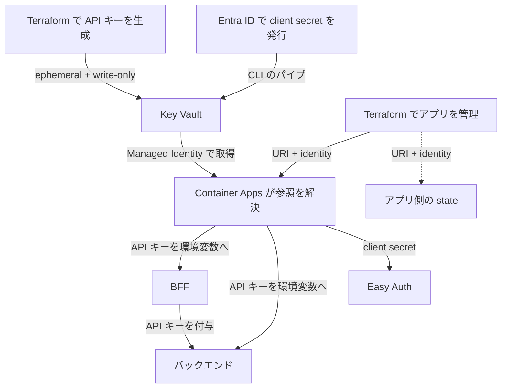

API キーやクライアントシークレットを Secret に入れても、その値を Terraform に渡していれば state に残ることがあります。`sensitive = true` で画面から隠していても、保存される場所が減るわけではありません。

Azure Container Apps で動かしている個人開発のチャットアプリで、アプリ間の API キーと、サインインに使うクライアントシークレットを Azure Key Vault 参照へ移しました。この記事では、**秘密値の発行元に応じた供給経路、切り替えの完了条件、更新・復旧の運用をどう選ぶか**を扱います。

対象読者は、Terraform でアプリへ秘密値を渡していて、「Secret 管理サービスに集約すれば十分か」「state からも外すべきか」を判断したい人です。

:::message
対象は個人で運用する `dev` 環境です。2026-09-22 の事前検証から、10-03 のクライアントシークレット移行までの実施記録をもとにしています。利用者は所有者本人で、計画的な更新中の認証失敗や再起動を許容しています。無停止のローテーションを実証した記事ではありません。

対象構成は Terraform 1.14.8、AzureRM provider 5.1.0、random provider 3.9.1 です。公式仕様と provider 実装は 2026-10-03〜10-04 に確認しました。
:::

## 先に結論

採用したのは、**秘密値を Key Vault に保管し、Container Apps には値ではなく参照を渡す**構成です。API キーは Terraform で生成し、クライアントシークレットは Terraform の外で発行します。発行経路を分けたうえで、どちらも最新の state に値を保存しない形にしました。

判断の核は3つです。

1. **誰が秘密値を発行・更新するか**で供給経路を選び、生成・書き込み・読み出しのどこにも state への保存経路を作らない。
2. **新しい値が利用側で使われたこと**を切り替えの完了条件にし、旧資格情報を無効にする順序を決める。
3. **値の変更検知・更新の遅延・再起動・復旧**まで含めて、state に値を保存しない構成を運用できるか判断する。

今回の到達点は、対象の2つの秘密値を最新の state から外し、新しい値でサインインとチャットが使えることを確認したところです。過去の state の内容を消す操作と、複数アプリを同時に更新する仕組みは含みません。

## 誰が、何のために秘密値を使っていたか

ブラウザからのリクエストは、フロントエンドのサーバー処理を経由してバックエンドに届きます。この中継処理を BFF（Backend for Frontend）と呼びます。

サインインには Container Apps の組み込み認証機能である Easy Auth を使います。アプリに付随する認証用コンテナ（sidecar）が Microsoft Entra ID とやり取りし、認可コードをトークンへ交換するときにクライアントシークレットを使います。[Microsoft Learn の Entra ID 認証設定](https://learn.microsoft.com/en-us/azure/container-apps/authentication-entra)

| 秘密値 | 利用者と用途 | 移行前の供給経路 | 不一致・失効時の影響 |
| --- | --- | --- | --- |
| API キー | BFF が付与し、バックエンドが照合。ブラウザへは渡さない | 通常の `random_password` resource → Container Apps の `secret.value` | チャット要求が認証エラーになる |
| クライアントシークレット | Easy Auth が Entra ID に対してアプリを認証する | Entra ID で発行 → tfvars → `secret.value` | 新規サインイン時のトークン交換が失敗する |

| 観点 | 今回の前提 |
| --- | --- |
| 実行者 | 所有者本人がローカルで Terraform と Azure CLI を操作 |
| 対象 | BFF とバックエンドの2つの Container App、および BFF 側の Easy Auth |
| 権限境界 | アプリの取得用 identity と、秘密値を書き込む所有者の権限を分ける。ロール割り当てと Entra ID の資格情報の発行は所有者が Terraform の外で管理 |
| 成功条件 | 対象値が最新の state に残らず、新しい値でサインインとチャットができる |

**state** は Terraform がリソースの状態を保存するデータです。値を含む場合は、state を読める主体にもその秘密値が見えます。

解きたかった課題は、**インフラ管理のために保存する state に、利用可能な秘密値を残し続けること**でした。アプリ管理者による秘密値の取得をすべて防ぐ設計ではありません。

たとえば、state を読む CI やバックアップの管理者に、アプリの秘密値まで読ませてよいかを確認します。許可できない主体が含まれ、state の権限をそれ以上絞れないなら、値を保存しない利点があります。今回は所有者中心の運用でしたが、今後の state の履歴にも秘密値を蓄積させないことを目的にしました。

ただし、Container Apps の `Microsoft.App/containerApps/listSecrets/action` は秘密値を平文で返す権限です。`Container Apps Contributor` や `Container Apps Operator` にもワイルドカード経由で含まれます。参照方式を採っても、アプリ側で秘密値を取得できる主体の権限管理は必要です。[Microsoft Learn の secret 管理権限](https://learn.microsoft.com/en-us/azure/container-apps/manage-secrets#permissions-for-managing-secrets)

## なぜ最初は値を state に残していたのか

先に、DB と Azure OpenAI への認証を Managed Identity に移しました。Managed Identity は、アプリが自前の長期資格情報を持たずに Microsoft Entra ID のトークンを取得できる仕組みです。

一方、BFF とバックエンドの間には API キーの照合を残しました。バックエンドを誤って外部公開する設定に戻しても、匿名の要求で LLM の課金を発生させないためです。サービス間のトークン認証に置き換える案もありますが、今回はキーの供給経路の変更に絞りました。

Easy Auth も、クライアントシークレットを使う認証構成を維持しました。この段階では、対象 provider の Container Apps secret に write-only の引数がなく、直接渡した値が state に残ることを受け入れていました。

後から見直したのは、**長期資格情報を残す判断と、その値を state に保存する判断は別にできる**という点です。既存の認証方式を変えなくても、Container Apps に Key Vault から取得させる経路を選べました。

## 保管先と、値が通る経路を同じ表で比べる

比較の条件は「既存の API キー認証と Easy Auth の認証構成を維持する」です。評価軸は、最新の state に値が残るか、更新をどこで行うか、障害時に何を扱うか、追加の運用が何か、の4つにしました。

ネットワークは、**Key Vault の公開エンドポイントを使い、ファイアウォールや private endpoint による制限を設けない構成**が前提です。アクセスは Entra ID の認証と Azure RBAC で制御します。ネットワークを制限した環境では、投入・読み取りを行う Terraform / Azure CLI の実行端末に加え、参照方式では Container Apps からも Key Vault に到達できることが採用条件になります。

制限された環境での名前解決・通信経路・許可設定と、参照の初回取得・更新時の同期は今回未検証です。権限の付与だけで利用可能とは判断せず、これらを確認してから比較表を適用します。[Key Vault のネットワーク制御](https://learn.microsoft.com/en-us/azure/key-vault/general/network-security)

| 構成 | 最新の state | 更新の操作 | 障害時に扱うもの | 追加の運用 |
| --- | --- | --- | --- | --- |
| Terraform で通常の resource や変数として値を扱い、直接渡す | 値が残る | Terraform 経由で新しい値をアプリへ反映 | アプリに保持した値と再起動 | state のアクセス制限・履歴管理 |
| Key Vault の値を Terraform の secret data source で読み、Container Apps にシークレットの値を直接指定する | 値が残る | Key Vault の更新に加え、Terraform 経由の反映 | Key Vault の取得とアプリへの注入 | Key Vault の権限・state の保護 |
| state に値を保存しない経路で Key Vault に書き、Container Apps が参照する | 対象値を保存しない | 発行側で新バージョンを投入し、アプリ側は自動追従 | 参照の同期・取得済みの値・再起動 | Key Vault の権限・同期失敗の監視・復旧手順 |

採用したのは3行目です。最新の state から対象値を外すことを成功条件にしたため、1・2行目では達成できません。3行目の書き込み経路は、秘密値の発行元に応じて分けます。

ただし、保管先の集約が目的で、state を秘密情報として保護する運用を受け入れるなら、2行目にも用途があります。1行目を続ける場合も、state へのアクセスを制限することは有効です。どちらも「state に値がない」という性質とは区別します。

採用案では Key Vault の操作、ログ取り込み、アラートの費用と管理対象が増えます。今回の記録では月額の増分は未集計です。費用削減を成果とはせず、秘密値の保存先を減らすための運用コストとして受け入れました。

## 発行元に応じて、state に値を保存しない経路を選ぶ

今回の2つの秘密値は、更新の責任を持つ場所が違います。

| 対象 | 発行・更新する場所 | Key Vault への投入 | アプリへの供給 |
| --- | --- | --- | --- |
| API キー | Terraform | ephemeral resource で生成し、write-only argument で書く | Container Apps が参照を解決し、環境変数へ渡す |
| クライアントシークレット | 所有者が操作する Entra ID | Azure CLI の出力を直接パイプし、Terraform へ渡さずに書く | Container Apps が参照を解決し、Easy Auth が使う |



### Terraform で発行する値は、生成側と書き込み側をそろえる

Terraform の機能は、次のように役割が違います。

| 機能 | 役割 |
| --- | --- |
| `sensitive` | 通常の CLI 出力などで値を伏せる。state や保存した plan への格納は防がない |
| ephemeral resource | 実行中だけ使う値を生成・取得し、state や plan に保存しない |
| write-only argument | provider に値を渡すが、その引数の値を state や plan に保存しない |

ephemeral resource は Terraform 1.10 以降、write-only argument は 1.11 以降の機能です。加えて、利用する provider が該当の resource・引数に対応している必要があります。[HashiCorp の機密データ管理](https://developer.hashicorp.com/terraform/language/manage-sensitive-data)と[ephemeral resource の説明](https://developer.hashicorp.com/terraform/language/manage-sensitive-data/ephemeral)で区別されています。

値を保存しない代わりに、次の2つを手放します。

- **秘密値そのものの比較による drift 検出・修復**。drift は設定と実環境のずれです。write-only の値には state 上の比較対象がないため、Key Vault 側の値を意図した値と比較して戻すことはできません。後述の `value_wo_version` は更新を指示する番号であり、値の一致を検査するものではありません。[HashiCorp の write-only の更新仕様](https://developer.hashicorp.com/terraform/language/manage-sensitive-data/write-only#update-write-only-arguments-with-versions)
- **state から同じ秘密値を復元すること**。今回の ephemeral `random_password` は再生成すると別の値になります。元の値が必要なら Key Vault 側で復元できるようにし、新しい値でよければ発行と利用側への再反映を復旧手順にします。

ただし、**secret 自体の削除検出まで失うわけではありません**。AzureRM 5.1.0 の実装では、refresh（実環境の状態の再取得）で secret の取得結果が 404 なら、再作成の対象になります。バージョンなどのメタデータも読み取るため、「値の比較ができない」と「plan に何も出ない」は区別します。[AzureRM 5.1.0 の読み取り実装](https://github.com/hashicorp/terraform-provider-azurerm/blob/v5.1.0/internal/services/keyvault/key_vault_secret_resource.go)

**秘密値の drift を Terraform の plan だけで検出・修復することが必須なら、この write-only の構成は選びません。** 採る場合は、値を更新できる主体の制限、更新操作の監査、利用側の動作確認を別に設計します。同期成功だけでは、その値が意図した値かまでは判断できません。

このプロジェクトでは、Key Vault と Container Apps を別の root module・state で管理しています。root module は、ここでは Terraform を実行する設定ディレクトリです。以下の「Key Vault 側」「アプリ側」はこの実行単位を指します。

次は実装の要点です。参照名は説明用に整理し、Key Vault 本体や変数の定義は省略しています。

```hcl
ephemeral "random_password" "chat_api_key" {
  length  = 64
  special = false
}

resource "azurerm_key_vault_secret" "chat_api_key" {
  name             = "chat-api-key"
  key_vault_id     = azurerm_key_vault.main.id
  value_wo         = ephemeral.random_password.chat_api_key.result
  value_wo_version = var.chat_api_key_version
}
```

ephemeral の値は保存できないため、通常の保存される引数へは渡せません。受け取る側も `value_wo` にします。通常の値を Key Vault の `value` に渡す構成では、書き込み側の state に値が残ります。

`value_wo_version` は、値を保存せずに更新を指示するための番号です。Key Vault が発行するバージョン ID とは異なります。今回のキー更新は `chat_api_key_version` を増やし、**Key Vault を管理する側で Terraform apply する**運用です。Container Apps を管理する側の apply は不要になります。

つまり、Terraform が秘密値を扱わなくなるわけではありません。実行中には生成・送信しますが、値の永続化を避けます。[AzureRM 5.1.0 の Key Vault Secret 定義](https://github.com/hashicorp/terraform-provider-azurerm/blob/v5.1.0/website/docs/r/key_vault_secret.html.markdown)に対応する引数があります。

### 外で発行する値は、Terraform を経由させずに投入する

クライアントシークレットは、所有者が Entra ID で発行し、Azure CLI の出力を `az keyvault secret set` の標準入力へ直接渡しました。今回の投入では値を画面やファイルへ出さず、tfvars や Terraform の変数にも渡していません。新旧の資格情報を併存させるため、発行には `az ad app credential reset --append` を使います。`--append` を省くと既存の資格情報を消す動作になるため、更新の順序に関わる指定です。[Azure CLI の credential reset](https://learn.microsoft.com/en-us/cli/azure/ad/app/credential?view=azure-cli-latest#az-ad-app-credential-reset)

ここで既存の tfvars の値を Key Vault へコピーする案もあります。しかし、同じ値を使い続けると過去の state に残った値も有効なままです。今回は新しい値を発行して切り替え、動作確認後に旧資格情報を削除する方針にしました。

この経路を選んだ理由は、今回の運用では Entra ID の資格情報の発行を Terraform の管理外に置いているためです。発行元も Terraform で管理する環境なら、利用する provider の対応を確認し、発行から書き込みまで値を保存しない経路を組めるかで判断します。

### 参照を設定するために、秘密値そのものを読み出さない

Container Apps には、Key Vault の URI と、それを取得する identity を渡します。両アプリの `secret` block を次の形にしました。

```hcl
locals {
  chat_api_key_secret_id = "${data.azurerm_key_vault.main.vault_uri}secrets/chat-api-key"
}

# azurerm_container_app 内の抜粋。identity はアプリへ割り当て済み。
secret {
  name                = "chat-api-key"
  key_vault_secret_id = local.chat_api_key_secret_id
  identity            = data.azurerm_user_assigned_identity.app.id
}
```

`data.azurerm_key_vault.main` で読むのは Vault のメタデータです。secret の値を取得する `data "azurerm_key_vault_secret"` を使うと、読み出した値が state に入るため使いません。参照だけが必要なら、値を取得せず URI を組み立てます。[AzureRM の secret data source の注意事項](https://github.com/hashicorp/terraform-provider-azurerm/blob/v5.1.0/website/docs/d/key_vault_secret.html.markdown)にも、取得した値が state に保存されることが明記されています。

アプリの identity には対象 Vault の `Key Vault Secrets User`、書き込む所有者には `Key Vault Secrets Officer` を付けました。前者は値の読み取り、後者は secret の管理に使う権限です。実装では既存の identity を共用しており、アプリごとの権限分離まで完了したわけではありません。

Easy Auth も同じ `key_vault_secret_id` と `identity` の形にし、`value = var.easy_auth_client_secret` を削除しました。Key Vault から値を取得する Managed Identity と、取得したクライアントシークレットで Entra ID にアプリを認証する Easy Auth は、役割が別です。

また、必要な secret が投入されているかを plan 時に確認するため、複数形の `data "azurerm_key_vault_secrets"` で名前の一覧を読み、precondition で存在を検査します。この data source が返すのは名前・ID などのメタデータで、秘密値ではありません。ただし、名前があることと、その資格情報でサインインできることは別の確認です。[AzureRM 5.1.0 の secret 一覧 data source](https://github.com/hashicorp/terraform-provider-azurerm/blob/v5.1.0/website/docs/d/key_vault_secrets.html.markdown)

## 切り替えの完了条件は、利用側で決める

参照の設定が apply できても、利用側が新しい値を使ったとは限りません。API キーなら BFF とバックエンドの値の一致に加え、チャットの成功を確認します。Easy Auth なら、既存のセッション cookie がない状態でサインインし、sidecar が新しい資格情報でトークンを取得できたことを確認します。

サインイン済みのタブを再読み込みするだけでは、この確認になりません。2026-10-03 の切り替えでは、新しいシークレットウィンドウからサインインし、sidecar の token POST が 200、続いて `LoginComplete` になることを確認しました。Key Vault とアプリが保持する値の一致も確認し、初めてアプリへ渡した新しい値で認証できたと判断しています。

### 旧資格情報を削除する前に、新しい値への移行を確認する

順序を決める根拠は、09-22 の事前検証にあります。Key Vault に新しいクライアントシークレットを投入した直後に Entra ID の旧資格情報を削除すると、Easy Auth はまだ旧値を使っており、`AADSTS7000215: Invalid client secret provided` でサインインが失敗しました。その後の自動同期と再起動を経て、新規サインインが成功しています。

この結果を踏まえ、移行では次の順序にしました。

1. 旧資格情報を残して新しい値を発行し、Key Vault へ投入する。
2. 参照へ切り替え、同期成功と値の一致、旧 replica の停止と新 replica の稼働を確認する。revision はデプロイ単位、replica はそれを動かす実行インスタンスです。
3. 既存の cookie がない状態でサインインし、トークン交換とチャットの成功を確認する。
4. 旧資格情報を削除し、再び新規サインインとチャットを確認する。

10-03 の切り替えでは新しい revision は作られませんでしたが、replica は入れ替わりました。revision 数や「同期成功」のログだけで、旧値を使うインスタンスがなくなったとは判断しません。更新前の replica を記録しておき、その停止まで確認する条件を運用手順にも入れました。

state の保存先ではバージョニングが有効なため、移行前の state には古い値が残ります。**最新の state から値を外すことと、過去の state に残った資格情報を無効にすることは別**です。クライアントシークレットは発行元で旧資格情報を削除し、API キーは両アプリが使う値を更新しました。履歴を消したわけではないため、state へのアクセス制限は継続します。

## 自動更新を選ぶと、同期を監視する責任が増える

参照 URI にはバージョンを付けませんでした。Microsoft Learn では、この場合、新しいバージョンを30分以内に取得し、該当 secret を環境変数で使う active revision を自動的に再起動すると説明されています。[Container Apps の secret URI と更新仕様](https://learn.microsoft.com/en-us/azure/container-apps/manage-secrets#key-vault-secret-uri-and-secret-rotation)

Easy Auth は環境変数ではなく `clientSecretSettingName` で secret を参照します。この経路でも自動追従と再起動が起きることは、09-22 の検証で確認しました。公式に書かれた範囲と、この環境で確かめた範囲を分けて採用の根拠にしています。

バージョンを固定すれば採用する値を明示できますが、更新のたびに参照先を変える運用が必要です。今回はその操作を減らすために自動追従を選びました。

### アプリが動いていても、次の値を取れるとは限らない

2026-09-22 の検証では、一度 secret を取得した後、identity から Key Vault の読み取りロールを外しました。すると定期同期は次の理由で失敗しましたが、アプリは取得済みの値で動き続けました。

```text
SyncingSecretFromAzureKeyVaultForContainerAppFailed
```

これは今回の検証で観測した動作です。権限を外してもいつまでも動く、あるいは再起動しても必ず動くという保証には使えません。

この動作から、死活監視だけでは「次の値を取得できるか」を確認できないと判断しました。そこで、Container Apps のシステムログを Azure Monitor の log search alert（ログの条件を評価するアラート）で監視しています。主要部分は次の KQL です。

```kusto
ContainerAppSystemLogs_CL
| where Reason_s == "SyncingSecretFromAzureKeyVaultForContainerAppFailed"
| summarize FailedCount = count() by ContainerAppName_s
```

今回は直近1時間を15分ごとに評価し、アプリごとの件数が0を超えたら所有者へ通知します。これはこの環境で採用した設定であり、失敗から15分以内に通知される保証ではありません。定期同期、ログ取り込み、アラート評価、通知配送がそれぞれ必要です。

受信後は対象アプリを特定し、secret の有効状態と identity の読み取り権限を確認します。復旧後は同期成功に加え、対象の秘密値を使うサインインやチャットの動作を確認します。

さらに 10-01 の検証では、Key Vault に新バージョンを作って手動で revision を再起動しても、コンテナには旧値が渡されました。その後の定期同期では新値に変わっています。この結果から、復旧手順では原因を解消して参照を設定し直し、取得した値の一致を確認する順にしました。

### 2つのアプリが同時に更新されるとは限らない

API キーは BFF とバックエンドが共有しています。一方だけが新しい値になれば、不一致の間は認証エラーになり得ます。30分以内の自動取得という仕様から、複数アプリの同時切り替えまでは導けません。

10-01 の実アプリの試験では、両アプリが新バージョンを同期し、revision が再起動しました。更新後のチャットも成功しています。ただし、更新中にチャット要求を流す試験はしていないため、認証エラーが起きなかったとも、無停止だったとも言えません。

**更新中も要求を成功させる必要があるなら、ここで判断が変わります。** たとえばバックエンドで新旧2つのキーを受理できるようにし、呼び出し側を新キーへ移して確認した後に旧キーを失効させます。これは今回未実装の選択肢です。URI のバージョン固定だけでは、共有キーを同時に切り替える問題は解消しません。

Easy Auth では Entra ID に新旧の資格情報を併存させられますが、今回のバックエンドは1つの API キーだけを受理します。同じ Key Vault 参照でも、利用側が新旧の値を受け入れられるかによって更新手順が変わります。また、新旧を併存させても replica の再起動はあるため、それだけで無停止を保証するものではありません。

## 復旧方法は、値の消失と取得経路の障害で分ける

### 値を失った場合に、同じ値へ戻す必要があるか

Key Vault の secret を誤削除した場合、soft-delete（論理削除）は保持期間内の復元に使えます。purge protection は、その期間が終わる前の完全削除を防ぎます。これらが守るのは削除からの復旧であり、誤った値への更新を取り消す機能ではありません。[Microsoft Learn の soft-delete と purge protection](https://learn.microsoft.com/en-us/azure/key-vault/general/soft-delete-overview)

今回の `dev` 環境は soft-delete の保持が7日、purge protection は無効で、Terraform の destroy 時には完全削除する設定です。同名での作り直しと、API キーの再生成・クライアントシークレットの再発行を選べることを優先しました。**この設定では、destroy 後に同じ秘密値へ戻す要件を満たせません。** 同じ値の復元が必要な環境では、削除保護と保持期間、必要なバージョンの保全、復旧権限・手順を決めて検証することが採用条件になります。

### 取得経路の障害時に、シークレットの値を直接指定して復旧できるか

Key Vault の読み取りが原因で切り替えに失敗した場合、復旧のために同じ Key Vault を読みに行く手順では戻せません。

API キーでは、切り替え前に両アプリへ設定する同一のキーを作業端末へ一時退避しました。所有者だけが読める権限で保管し、09-28 に Azure CLI で次の往復を検証しています。

```text
Key Vault 参照
  → 退避した同じ値を、両アプリのシークレットに直接指定
  → revision を再起動し、チャットの動作を確認
  → Key Vault の参照に戻し、同期と値の一致を確認
  → 一時退避した値を削除
```

これは Key Vault の取得経路を迂回するための一時退避です。秘密値の保管場所が一時的に増えるため、退避データへのアクセス制限と削除までを手順に含めます。

Key Vault 参照に戻した直後について、今回の記録で確認できるのは同期と値の一致までです。運用手順として採るなら、Key Vault 参照に戻した後のチャット確認も退避データを削除する条件に加えます。

Easy Auth では、Key Vault が読めなくても Entra ID で復旧用の資格情報を新規発行できる前提で、ARM API の PATCH によりシークレットの値を直接指定して復旧する手順を用意しました。Key Vault 参照を使う構成と、シークレットの値を直接指定する構成の切り替えは API キーで検証済みですが、この Easy Auth 固有の操作手順は実機演習していません。自分の環境で採用する際も、**復旧用の値をどこから確保するかと、対象の secret をどう書き換えるか**を確認する必要があります。

ここで重要なのは、**シークレットの値を直接指定している間は、Container Apps 側の Terraform を plan を含めて実行しない**ことです。対象 provider が直接指定したシークレットの値を読み取ると、state や保存した plan に値が再び入る経路を作るためです。

CI など別の実行者が同じ state を扱う環境なら、そちらも止める必要があります。Key Vault とアプリを1つの state で管理するなら、その実行単位全体が停止対象です。参照に復帰したことを確認してから Terraform の実行を再開し、最終的な差分を確認します。

## 何をもって移行できたと判断したか

事前検証で参照方式の振る舞いを確認し、各移行では対象の値が届いて実際に使えることを確認しました。Easy Auth の移行では、09-22 の自動追従試験に加え、09-28 にシークレットの値を直接指定してから Key Vault 参照へ戻せたことを根拠として引き継ぎ、新規発行した値での認証と旧資格情報の削除を追加確認しています。

| 成功条件 | 確認方法と結果 | 証拠の範囲 |
| --- | --- | --- |
| 最新の state に対象値を保存しない | API キーは生成側・アプリ側の state を確認。client secret は事前検証済みの参照方式へ切り替え、値を渡す変数を削除 | 対象の2つの秘密値。plan の差分なしだけでは、state に値が保存されていないことの証拠にならない |
| 利用側が新しい値を使える | 値の一致に加え、チャットと新規サインインの成功を確認。Entra ID の旧資格情報削除後も成功 | 切り替え後の機能確認。更新中の可用性は未実証 |
| 自動更新に追従する | 事前検証で環境変数・Easy Auth 両経路を確認し、実アプリでも API キー更新を確認 | Easy Auth の追従確認は事前検証を引き継ぐ。更新中の要求成功率は未計測 |
| 同期失敗を検知・通知できる | 同期失敗アラートの発火・自動解決と、メール・push の受信を確認 | アラートの条件評価と通知配送を分けて検証 |

秘密値の確認結果は、値そのものをログへ出さず、一致・不一致や属性の有無で記録しました。

旧資格情報への対処も対象ごとに区別します。Easy Auth は Entra ID で旧資格情報を削除したことを確認しました。API キーは新値への一致と動作を確認していますが、旧キーを提示して拒否されることを確かめる試験は記録されていません。

## 自分の環境なら、どこで判断を変えるか

接続先とアプリがトークン認証に移れるなら、長期資格情報をなくす選択肢があります。資格情報を残す場合は、次の3点で判断できます。

1. **state から値を外す必要があるか。** state を読める主体が秘密値を読んでよい主体より広く、権限をそれ以上絞れない場合や、履歴・バックアップに今後の秘密値を蓄積させたくない場合は、採用する理由があります。履歴保持期間とローテーション周期の長短だけでは決めません。旧資格情報を失効できるかも確認します。
2. **Key Vault への取得経路と更新を運用できるか。** 実行端末と Container Apps からの通信、取得権限、同期失敗を受けて対応する担当者を確保できることが条件です。更新中の認証失敗を許容できないなら、新旧の値を併存させる仕組みや切り替え手順も検証します。確保できなければ、シークレットの値を直接指定する構成の継続を検討します。
3. **値の検証と復旧を state に頼らず行えるか。** write-only を選ぶなら、秘密値の比較による drift 検出を plan に求めず、更新権限・監査・動作確認で運用できる必要があります。同じ値の復元と、新しい値の再発行のどちらが必要かを決め、その手順を検証します。満たせなければ、発行・保管・復旧の設計を先に見直します。

1に該当せず、state と履歴へのアクセス制限、保管期間、旧資格情報の失効で要件を満たせるなら、シークレットの値を直接指定する構成を続ける判断もできます。保管先の集約だけが目的なら、比較表の2行目も候補です。**値を保存しない利点が必要で、取得・更新・復旧まで運用できるか**を採用の境界にします。参照方式へ移しても、過去の state の保護と Container Apps の `listSecrets` 権限の管理は引き続き必要です。
