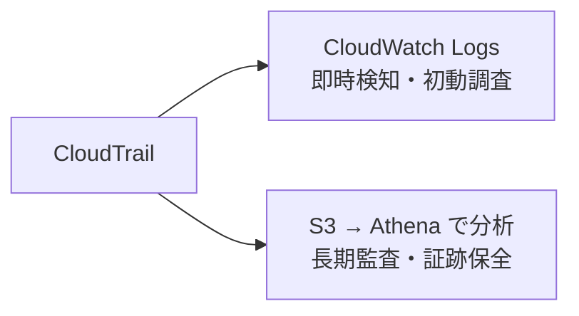

## はじめに

この記事は、AWS CloudTrail のログ保持期間を設定したが「なぜその日数にしたか」を説明できないエンジニア向けです。

この記事では次を扱います。

- なぜ「なんとなく90日」になるのか
- CloudWatch Logs と CloudTrail ログ用 S3 の役割の違いと、それぞれの保持期間の考え方
- CIS Benchmark の1年推奨が何に対するものか

## 運用コンテキストと確認環境

個人 DevOps ポートフォリオ `terraform-hannibal` の `foundation` レイヤで作業しました。対象は `dev` 相当の AWS 環境です。

| 項目 | 値 |
|---|---|
| Terraform | `1.14.8` |
| AWS Provider | `6.7.0` |
| 対象リージョン | `ap-northeast-1` |
| 確認時点 | 2026年5月 |

## 先に結論

| ストレージ層 | 変更前 | 変更後 | 根拠 |
|---|---|---|---|
| CloudWatch Logs | 90日 | **30日** | 即時検知・初動調査用途に十分。コスト削減 |
| CloudTrail ログ用 S3 lifecycle | 90日 | **365日** | 長期監査の正本。CIS Benchmark が1年を推奨 |

:::message
CIS Benchmark の「CloudTrail ログを1年以上保持せよ」という推奨は、CloudTrail ログ用 S3 に保存されるログ（監査証跡の正本）に対するものです。CloudWatch Logs の保持期間については具体的な推奨値はなく、用途とコストから判断します。
:::

## なぜ「なんとなく90日」になったか

今回は既存の S3 バケット（`nestjs-hannibal-3-cloudtrail-logs`）を `terraform import` で Terraform 管理化する作業の中で、保持期間を設定しました。

CloudWatch Logs の retention が90日だったため、CloudTrail ログ用 S3 の lifecycle も揃える形で90日に設定しました。「揃えた」以上の根拠は記録に残っていませんでした。

両方90日で揃えた結果、2つのストレージ層の役割の違いが保持期間に反映されない状態になりました。

## CloudWatch Logs と CloudTrail ログ用 S3 の役割の違い

CloudTrail は2つのストレージ層にログを送ります。

- **CloudWatch Logs** — CloudWatch 管理のストレージに保存（S3 とは別）
- **CloudTrail ログ用 S3** — S3 バケットに保存（Athena で SQL クエリして分析）

それぞれの役割は別物です。



**CloudWatch Logs**

- root アカウント使用、IAM ポリシー変更などをリアルタイムに検知してアラームを鳴らす
- 「アラームが鳴ってから調査を終えるまでの期間」あれば用途を満たす
- 30日あれば即時検知・初動調査には十分

**CloudTrail ログ用 S3**

- CloudTrail が `.json.gz` 形式で S3 に書き込み、Athena で SQL クエリして分析する
- 過去のアクセスや操作の監査証跡として保持する
- インシデント後の事後調査・コンプライアンス確認に使う
- 長期保持が必要なのはこちら

## CIS Benchmark とは

CIS（Center for Internet Security）は、サイバーセキュリティのベストプラクティスを策定する非営利団体です。その成果物である **CIS Benchmarks** は業界標準として広く参照されており、AWS のセキュリティ状態を一元管理するサービス **AWS Security Hub** でも CIS Benchmark に基づいたセキュリティチェックを実行できます。

AWS 向けには **CIS AWS Foundations Benchmark** があり、「CloudTrail ログを1年以上保持すること」などの具体的な設定基準が定義されています。この「1年以上」は、CloudTrail ログ用 S3 に保存されるログを対象にしています。

CloudWatch Logs の保持期間については CIS Benchmark に具体的な推奨値はありません。「用途に対して十分か」「コストは許容範囲か」から判断する領域です。

## 変更内容

### CloudWatch Logs：90日 → 30日

```diff
resource "aws_cloudwatch_log_group" "cloudtrail" {
  name              = "/aws/cloudtrail/nestjs-hannibal-3"
- retention_in_days = 90
+ retention_in_days = 30
}
```

即時検知・初動調査用途に30日で十分です。CloudWatch Logs のストレージコストを削減できます。

### CloudTrail ログ用 S3 lifecycle：90日 → 365日

```diff
resource "aws_s3_bucket_lifecycle_configuration" "cloudtrail_logs" {
  rule {
-   id   = "expire-cloudtrail-logs-after-90-days"
+   id   = "expire-cloudtrail-logs-after-365-days"
    expiration {
-     days = 90
+     days = 365
    }
  }
}
```

長期監査の正本として CIS Benchmark の1年推奨に合わせました。

## 選ばなかった選択肢

**CloudTrail ログ用 S3 を無期限保持（lifecycle 撤廃）**

本番環境でコンプライアンス要件がある場合は有力な選択肢です。今回は dev 環境でコストを抑えたいため、CIS 推奨の1年に留めました。

**両方を同じ期間に揃える**

2つのストレージ層の役割の違いが期間に反映されないため不採用です。「なぜその日数か」の根拠も層ごとに別になるはずで、揃える理由がありません。

## 検証結果

`terraform apply -target` で対象リソースだけに変更を絞りました。

| 段階 | 確認内容 | 結果 |
|---|---|---|
| 静的検証 | `terraform fmt` / `terraform validate` | Pass |
| plan | `aws_cloudwatch_log_group` / `aws_s3_bucket_lifecycle_configuration` の2件変更 | `2 to change, 0 to destroy` |
| apply | CloudWatch Logs 30日・CloudTrail ログ用 S3 lifecycle 365日を AWS に反映 | `2 changed` |
| 最終 plan | 差分なし | `No changes` |

## まとめ

同じ日数に揃えると「なぜその日数か」の根拠が曖昧になります。CloudWatch Logs と CloudTrail ログ用 S3 はそれぞれ「即時検知用」「長期監査用」と役割が違うため、保持期間の根拠も別の軸で決めます。

CIS Benchmark の1年推奨は何に対するものかを確認してから適用することが重要です。「CloudWatch Logs も1年にしなければ」と誤解すると、コストだけ増えて用途には過剰になります。

dev 環境なら「CIS 推奨の1年に満たないが用途とコストから割り切り」という説明責任を取れる状態が、なんとなく設定するより価値があります。

## 参考リンク

- [CIS AWS Foundations Benchmark](https://www.cisecurity.org/benchmark/amazon_web_services) — CloudTrail ログ1年保持などの推奨設定
- [Amazon CloudWatch Logs pricing](https://aws.amazon.com/jp/cloudwatch/pricing/) — 保存コストの確認に
- [AWS CloudTrail User Guide: Log file integrity validation](https://docs.aws.amazon.com/awscloudtrail/latest/userguide/cloudtrail-log-file-validation-intro.html) — 長期監査の正本としての S3 活用
