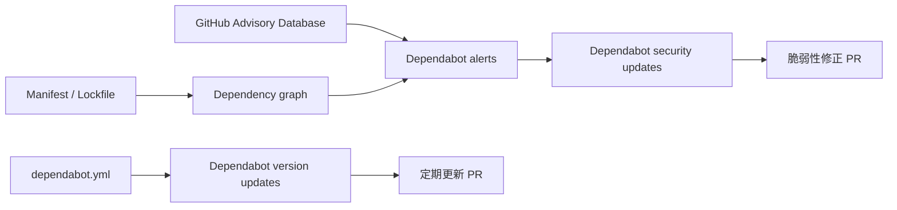

## 対象読者

- Dependabot を有効化したものの、どの機能が何をしているのか整理できていない人
- GitHub Actions の更新だけを Dependabot に任せたい人
- Dependabot alerts を有効化した後、想定以上の Alert や PR が出て困っている人

## 先に結論

- 「Dependabot を有効化する」という操作は1つではありません。Dependency graph、Dependabot alerts、Dependabot security updates、Dependabot version updates は、それぞれ依存関係の認識・検出・修復・予防を担当します
- `.github/dependabot.yml` で `github-actions` だけを設定していても、repository settings で Dependabot alerts を有効化すると、対応する manifest / lockfile に記録された npm 依存も検査対象になります
- 2026年6月10日に有効化したところ、GitHub Actions ecosystem の Alert は0件、npm の open Alert は65件でした。これは65個の脆弱性が突然発生したのではなく、既存の依存関係と既知 Advisory の一致が可視化された結果です

:::message
この記事は terraform-hannibal（個人の DevOps ポートフォリオ）を題材にしています。チーム規模は1人、対象は dev 環境のみです。Dependabot PR は自動マージせず、既存の CI と人間のレビューを通してからマージします。

記事内の件数は2026年6月10日時点の観測結果です。Alert や SBOM の件数は依存関係と Advisory Database の更新で変化します。
:::

## GitHub Actions の Alert を有効にしたかった

前回は、GitHub Actions の参照を次の2段階に分けました。

- GitHub-owned action: `@vX.Y.Z` で固定し、Dependabot alerts を維持する
- 外部 action: `@<full-length-sha> # vX.Y.Z` で固定し、タグ改ざんへの耐性を優先する

詳しい判断過程は前回の記事で扱っています。

https://zenn.dev/kmryst/articles/github-actions-sha-pin-owner-tier

この設計を機能させるには、repository level の Dependabot alerts と Dependabot security updates が有効である必要があります。しかし確認すると、どちらも無効でした。

設定状態は GitHub CLI から確認できます。`OWNER/REPO` は自分のリポジトリへ置き換えます。どちらの確認にも repository の Administration read 権限が必要です。

```bash
REPO=OWNER/REPO

# Dependabot alerts: 204 = enabled、404 = disabled
gh api -i "repos/$REPO/vulnerability-alerts"

# Dependabot security updates: 200 + JSON = enabled、404 = disabled
gh api -i "repos/$REPO/automated-security-fixes"
```

2026年6月10日の設定前は、terraform-hannibal ではどちらも `404` でした。有効化後は、Alerts が `204`、Security updates が `200` と `{"enabled":true,"paused":false}` を返すことを確認しました。

一方、`.github/dependabot.yml` には、すでに GitHub Actions の version updates だけを設定していました。

```yaml
version: 2
updates:
  - package-ecosystem: "github-actions"
    directory: "/"
    schedule:
      interval: "weekly"
```

この状態から Dependabot alerts と security updates を有効化したので、意識は完全に GitHub Actions へ向いていました。

ところが、有効化直後に表示されたのは npm の Alert 65件でした。

## 4つの機能は別物だった

混乱の原因は、Dependabot 周辺の4機能をひとまとめに考えていたことです。それぞれの責務を分けると、今回の挙動を説明できます。

ここでいう Advisory は、影響を受けるバージョンや修正版などを記録した脆弱性情報です。Alert は、リポジトリ内の依存バージョンが Advisory の影響範囲と一致したときに作られる通知です。

| 機能 | 役割 | 主な設定場所 | 生成・表示されるもの |
|---|---|---|---|
| Dependency graph | manifest / lockfile から直接・推移依存を認識する | Repository settings | 依存関係一覧、SBOM（ソフトウェア部品表） |
| Dependabot alerts / vulnerability alerts | Dependency graph と GitHub Advisory Database を照合する | Repository settings | 既知脆弱性の Alert |
| Dependabot security updates | Alert を解消するための依存更新を提案する | Repository settings | Security update PR |
| Dependabot version updates | 脆弱性の有無に関係なく、設定した ecosystem を定期更新する | `.github/dependabot.yml` | Version update PR |



重要なのは、`dependabot.yml` が4機能すべての対象範囲を決めるわけではないことです。

`package-ecosystem: "github-actions"` は、GitHub Actions の **version updates** を設定しています。一方、Dependabot alerts は repository level で有効化され、Dependency graph が認識した対応 ecosystem の依存関係を GitHub Advisory Database と照合します。

さらに、security updates は `dependabot.yml` に npm の設定がなくても、repository settings で有効なら脆弱な npm 依存を更新する PR を作れます。

つまり、GitHub Actions の version updates だけを設定していても、Alerts と security updates の対象が GitHub Actions だけに限定されるわけではありません。

## 有効化したら何が見えたか

2026年6月10日に設定を有効化・確認した結果は次のとおりです。

| 確認対象 | 結果 |
|---|---|
| Dependency graph | SBOM に1,143 packages |
| Dependabot alerts | npm の open Alert が65件 |
| GitHub Actions ecosystem | Alert 0件 |
| Dependabot security updates | 有効。npm の更新 PR が生成された |
| Dependabot version updates | GitHub Actionsのみ設定済み。今回の変更対象外 |

設定変更と確認結果は [PR #364](https://github.com/kmryst/terraform-hannibal/pull/364)、65件の初期スナップショットと対応条件は [Issue #365](https://github.com/kmryst/terraform-hannibal/issues/365) に記録しています。

GitHub Actions については、使用中 action を GitHub Advisory Database と照合し、現在の参照が既知 Advisory の影響範囲外であることを前回確認済みです。本記事では、その確認手順は繰り返しません。

### 65件は65パッケージではない

65件の Alert を GitHub API から集計すると、対象は29パッケージでした。同じパッケージに複数の Advisory があるため、Alert 件数とパッケージ数は一致しません。

| 分類 | 内訳 |
|---|---|
| Severity | critical 3 / high 27 / medium 27 / low 8 |
| Manifest | root `package-lock.json` 51 / `client/package-lock.json` 14 |
| 依存関係 | direct 14 / transitive 51 |
| Scope | runtime 39 / development 26 |
| 対象パッケージ数 | 29 |

複数の Alert が出ていた主なパッケージは次のとおりです。

| Package | Alert件数 |
|---|---:|
| `vite` | 10 |
| `minimatch` | 8 |
| `multer` | 7 |
| `lodash` | 3 |
| `picomatch` | 3 |
| `qs` | 3 |

この数字から、Severity の件数だけを見て65回の個別修正を計画するのは適切ではないと分かります。推移依存は親パッケージの更新でまとめて解消することがあり、1つのメジャーバージョン移行が複数Alertの修復単位になることもあります。

## 65件のAlertから65件のPRは作られなかった

Security updates を有効化すると、2026年6月10日に最初の6件、翌6月11日に1件のDependabot PRが作られました。

| 結果 | PR |
|---|---|
| マージできた更新 | [#358](https://github.com/kmryst/terraform-hannibal/pull/358)〜[#361](https://github.com/kmryst/terraform-hannibal/pull/361)の4件 |
| 個別PRのままではマージできなかった更新 | [#362](https://github.com/kmryst/terraform-hannibal/pull/362)、[#363](https://github.com/kmryst/terraform-hannibal/pull/363)、[#368](https://github.com/kmryst/terraform-hannibal/pull/368)の3件 |

マージできた4件は、推移依存を親パッケージと一緒に更新するなど、比較的限定された変更でした。

残る3件は、NestJS 11 / Apollo Server 5への移行が複数PRへ分かれ、backendの必須CIを通せない状態になりました。そのため、3件を1つの統合移行として扱う方針に切り替えています。

個別ライブラリの移行理由と統合PRの設計は、本記事のスコープから外します。ここで重要なのは、**Alert件数、パッケージ数、修正PR数、実装上の修復単位は一致しない**ことです。

## 有効化する機能をどう選ぶか

Dependabot の構成を選ぶときは、次の3軸で考えます。

- **Visibility（可視性）**: 既知脆弱性を検出できるか
- **Remediation（修復支援）**: 修正PRまで自動生成するか
- **Operational Overhead（運用負荷）**: 誰がAlertとPRを継続的に処理するか

自分のリポジトリへ当てはめる場合は、表を読む前に次の3点を確認します。

1. Dependabot 以外に、既知脆弱性を検出する経路があるか
2. 自動生成されたSecurity update PRを、CIと人間のレビューで継続的に処理できるか
3. 脆弱性がなくても、古い依存のversion driftを定期的に減らしたいか

| 構成 | Strength | Limitation | 向いている状況 |
|---|---|---|---|
| Version updatesのみ | 古い依存を定期更新できる | 既知脆弱性の検出とは別機能 | 脆弱性検出を別製品・別組織が担当する |
| Dependency graph + Alerts | 脆弱性を可視化し、人間が修復方法を選べる | 修正PRは自動生成されない | 修復フローをIssueや別ツールで管理する |
| Graph + Alerts + Security updates | 検出から修正PR作成まで自動化できる | PRの競合・CI失敗を人間が処理する必要がある | CIとレビュー体制があり、自動マージしない運用 |
| 上記 + Version updates | 脆弱性対応に加え、日常的なversion driftも抑えられる | PRレビューの継続コストが最も高い | 予防と修復を両方Dependabotへ任せられる |

terraform-hannibal では、最後の構成を最終形として採る方針です。ただし、version updates は現時点でGitHub Actionsだけを対象とし、npmについては65件の棚卸し後に更新単位とgroupingを設計することにしました。

この構成のfailure mode（失敗時の現れ方）は、AlertとPRが一度に増えてレビューが滞ることです。自動マージを使わなければ、変更のblast radius（影響範囲）はPR段階に止まります。処理能力を超えた場合も、Alertsを消すのではなく、Security update PRの生成方法や優先度を調整します。

## 採らなかった対応

### Alertが多いのでAlertsを無効へ戻す

採用しませんでした。無効化しても依存関係や既知脆弱性は消えず、見えなくなるだけだからです。

PRの量が運用能力を超える場合は、Alertsによる可視性を残し、security updatesの自動PR生成やgrouping、対応優先度を調整する方が目的に合います。

### 生成されたPRをすべて自動マージする

採用しませんでした。実際に7件中3件はbackend CIを通せず、複数パッケージをまとめて移行する必要がありました。

Dependabotは修正候補を作れますが、その変更がアプリケーションの依存関係全体として成立することまでは保証しません。少なくともmajor updateや推移依存の親更新を含むPRは、CIと人間のレビューを通す必要があります。

### Severity順に1件ずつ直す

採用しませんでした。65件のうち51件は推移依存であり、同じ親パッケージの更新で複数Alertを解消できるためです。

まずmanifest、runtime / development、direct / transitive、共通の親パッケージで分類し、実装可能な修復単位を決めます。Severityは優先度を決める重要な入力ですが、作業単位そのものではありません。

## 有効化は運用の開始だった

Dependabot alerts の有効化は、脆弱性を増やしたのではなく、これまで見えていなかった状態を可視化しました。

ただし、可視化しただけでは修復は完了しません。誰がAlertを分類するのか、Security update PRをどのCIへ通すのか、Botが分割できない移行をどこで人間が再設計するのかまで決めて、初めて運用になります。

「Dependabotを有効化したか」ではなく、次を別々に問う必要があります。

- 依存関係を認識できているか
- 既知脆弱性を検出できているか
- 修正候補を作れているか
- そのPRを安全に取り込めるか

次は、可視化された65件をどのように分類し、NestJS 11 / Apollo Server 5の統合移行へまとめたかを扱います。

---

## 参考

- [GitHub Docs - About supply chain security](https://docs.github.com/en/code-security/concepts/supply-chain-security/about-supply-chain-security)
- [GitHub Docs - How the dependency graph recognizes dependencies](https://docs.github.com/en/code-security/concepts/supply-chain-security/dependency-graph-data)
- [GitHub Docs - Dependabot alerts](https://docs.github.com/en/code-security/concepts/supply-chain-security/dependabot-alerts)
- [GitHub Docs - Dependabot security updates](https://docs.github.com/en/code-security/concepts/supply-chain-security/dependabot-security-updates)
- [GitHub Docs - Dependabot version updates](https://docs.github.com/en/code-security/concepts/supply-chain-security/about-dependabot-version-updates)
- [GitHub Docs - About the dependabot.yml file](https://docs.github.com/en/code-security/concepts/supply-chain-security/about-the-dependabot-yml-file)
- [GitHub Docs - Vulnerable dependency detection](https://docs.github.com/en/code-security/reference/supply-chain-security/troubleshoot-dependabot/vulnerable-dependency-detection)
- [GitHub Docs - REST API endpoints for repositories](https://docs.github.com/en/rest/repos/repos)
