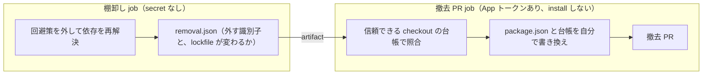
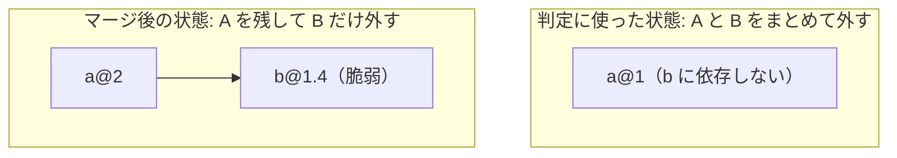

npm の `overrides` や Yarn の `resolutions` は、入れるときの理由ははっきりしています。脆弱なバージョンを exact pin している依存がいる、上流のバグで依存解決が落ちる、などです。ところが、上流が直ったあとに外すきっかけはどこにもありません。覚えている人がいれば外れますが、いなければ残り続け、依存の更新を黙って足止めします。

この記事では、回避策を解除条件つきの例外として台帳で管理し、外せるようになったら GitHub App が撤去 PR を自動で作る仕組みを紹介します。山場は npm `overrides` の「もう要らない」の判定方法です。最初の実装は、Codex のレビューで 2 回続けて穴を指摘されました。

## 対象読者

- `overrides` / `resolutions` や Dependabot の `ignore` を入れたまま、外すタイミングを人の記憶に頼っている人
- 「不要になったら CI を赤にして知らせる」仕組みを作ったのに、赤が放置されている人
- 依存解決を伴う CI ジョブに、書き込み権限のあるトークンを持たせたくない人

## 先に結論

- 回避策が外せるようになったら、赤や Issue コメントで知らせるのではなく、GitHub App に撤去 PR を作らせます。人の作業は「レビューしてマージする」だけになります
- npm `overrides` を全部まとめて外して判定すると、ある override を外したことで依存グラフから消えたパッケージに対する別の override が「不要」に見え、まだ必要な override を外す PR が立ちます
- 判定は **マージ後と同じ状態（その 1 件だけを外した状態）** で行い、撤去 PR 1 本につき 1 件に限りました。判定に使う状態と PR の中身が一致するので、依存どうしの絡み方を推測する必要がなくなり、誤るとしても安全側にしか倒れません

:::message
**運用コンテキストと前提**

- 題材は個人のポートフォリオリポジトリ [idp-golden-path](https://github.com/kmryst/idp-golden-path)（Backstage ベースの IDP）です。チームは 1 人です
- 実行者は GitHub Actions の週次 schedule です。撤去 PR は自動マージせず、CI と人のレビューを通してマージします
- 対象環境はリポジトリ内の宣言ファイル（`package.json`、`.github/dependabot.yml`）と台帳だけで、dev / staging / prod のどのクラウド環境にも触れません
- 失敗時の影響範囲は「不要な PR が立つ」か「撤去 PR が立たない」までです
- 権限境界: 依存を解決する job は secret を持ちません。PR を作る job だけが GitHub App のトークン（Contents と Pull requests の Read and write、インストール先はこのリポジトリのみ）を持ちます
- 2026-10-05 時点で撤去 PR 化が済んでいるのは、npm `overrides`、脆弱性以外の理由で入れた Yarn `resolutions`、Dependabot の `ignore` の 3 種類です。脆弱性対応の Yarn `resolutions` と監査例外はまだです
- Yarn 4.18.1、`actions/create-github-app-token` v3、`peter-evans/create-pull-request` v8 で確認しています

:::

## 用語

| 用語 | 意味 |
| --- | --- |
| `overrides`（npm）/ `resolutions`（Yarn） | 推移的依存のバージョンを上書きする機能。目的が同じなので、以下では両方まとめて扱います |
| Dependabot `ignore` | `.github/dependabot.yml` で特定の更新（例: メジャー更新）を止める設定 |
| 台帳 | この記事での呼び名です。`package.json` にはコメントを書けないため、回避策ごとに理由・対応する advisory・適用先を持つ JSON ファイルを別に置いています |
| 撤去 PR | この記事での呼び名です。不要と判定された回避策を、宣言ファイルと台帳から消す PR |
| skeleton | Backstage のソフトウェアテンプレートが新しいリポジトリを作るときの雛形ディレクトリ。このリポジトリではルートと同じ npm 依存を持ちます |

## 知らせるだけでは、外されなかった

台帳と週次の棚卸しは、もともとありました。npm `overrides` の台帳 `scripts/ci/npm-overrides.json` は、1 件ごとに次のように書きます。

```json
{
  "pattern": "smol-toml",
  "override": "^1.8.0",
  "directories": [".", "backstage/templates/service-baseline/skeleton"],
  "advisories": ["GHSA-..."],
  "dependents": ["markdownlint-cli2@0.23.2"],
  "reason": "markdownlint-cli2 0.23.2 が smol-toml 1.7.0 を exact pin しており…"
}
```

毎回の CI では、台帳と `package.json` の `overrides` が双方向に一致しているかを検査します。週次の `npm Overrides Inventory` は、override を外した一時プロジェクトで `npm install --package-lock-only --ignore-scripts` を実行して lockfile を解決し直し、`npm audit` で台帳記載の advisory が再出現するかを見ます。再出現しなければ不要なので、ジョブが赤になります。

この `smol-toml` は、`markdownlint-cli2` 0.23.3 が修正版を exact pin するようになって不要になりました。棚卸しが赤になり、人が撤去しています（Issue #302）。仕組みとしては動いていました。

ただし、やっていたのは「気づかせる」までで、外す差分は人が作っていました。そして、知らせても放置される実例が出ました。Dependabot の `ignore` にも同じ棚卸しがあり（後述）、jsdom のメジャー更新を止めていた `ignore` が 2026-09-21 に「外せる」と判定され、追跡 Issue に自動コメントが付きました。このコメントは 11 日間対応されませんでした（Issue #146）。

週次ジョブの赤も同じで、気づいた人が差分を作るまで赤のまま残ります。Google の SRE 本は第 1 章の冒頭に、SRE で昔から言われている "Hope is not a strategy."（希望は戦略ではない）を掲げています。次は気をつける、で済ませるのをやめ、外す PR そのものを届けることにしました。

[Google SRE Book: Introduction](https://sre.google/sre-book/introduction/)

## 評価軸

構成を選ぶときは、次の 3 つで比べました。

- **人の作業が残るか**（Operational Overhead、運用負荷）: 通知を受けた人が差分を作る工程が残ると放置される
- **書き込みトークンの影響範囲**（blast radius）: 未検証の上流コードが動く場所から、書き込みトークンが見えないか
- **誤るときの方向**（failure mode）: 判定を誤ったとき、まだ必要な回避策を外す側に倒れないか

## 撤去 PR の仕組み（Yarn resolutions で最初に作った）

撤去 PR の仕組みは、脆弱性以外の理由で入れた Yarn `resolutions` を対象に最初に作りました（PR #293）。上流の Yarn のバグ（[yarnpkg/berry#7281](https://github.com/yarnpkg/berry/issues/7281)）を避けるための `"@yarnpkg/core/got": "npm:11.8.2"` が最初の対象です。

### PR は GitHub App で作る

`GITHUB_TOKEN` で行った操作は、原則として新しいワークフロー実行を作りません。PR の作成や更新で起きる `pull_request` イベントも、実行が承認待ちの状態になります。そのままでは必須の status check が自動で走らないので、撤去 PR を自動で届ける意味が薄れます。個人の PAT は、有効期限の管理と権限の広さが問題になります。GitHub App なら、権限とインストール先を絞れ、トークンは job の終了時に失効します。

[GitHub Docs: GITHUB_TOKEN](https://docs.github.com/en/actions/concepts/security/github_token)

### 依存を解決する job と、書き込む job を分ける

棚卸しは毎週、上流の最新のパッケージを引いて依存を解決します。その途中で未検証のコードが動く余地があります（例: git 依存の `prepare` スクリプト）。そこで、書き込みトークンと同じ job には置きません。



job 間で渡すのは `removal.json` だけです。撤去 PR job は、識別子が台帳に載っているかを照合し、差分と PR 本文を自分で生成します。artifact に他のファイルや余分なフィールドがあれば、拒否して赤になります。

最初は、棚卸し job が作った `package.json` を撤去 PR job がコピーするだけの実装でした。PR #293 の Codex レビューで、「棚卸し job 側で `package.json` に `scripts.postinstall` を混ぜれば、そのまま App 名義の PR に入り、PR の CI でそのコードが動く」と指摘されました。識別子だけを渡す今の形はその修正です。

### lockfile は PR に含めない

同じ理由で、棚卸し job が作った lockfile も信用しません。撤去 PR には宣言ファイルと台帳だけを入れます。lockfile が変わると分かっている場合は PR を Draft で作り、本文の冒頭に「`npm install --package-lock-only --ignore-scripts` を実行して lockfile をコミットしてから Ready for review にする」と書きます。Draft はマージできないので、人の作業が残っている目印になります。

撤去 PR のブランチ名は種類ごとに固定です。再実行しても PR は重複せず、既存の PR が更新されます。

### 判定結果は 3 つに分ける

| 結果 | ジョブの色 | 動作 |
| --- | --- | --- |
| 外せる | 緑 | 撤去 PR を作る |
| まだ必要 | 緑 | 何もしない |
| 機構の故障（registry に届かない、台帳と宣言ファイルの不一致など） | 赤 | 撤去 PR は作らない |

赤になるのは、人が見る必要があるときだけです。故障は GitHub Actions の失敗通知で運用者に届きます。「外せる」と故障を取り違えると、通信障害の週に不要な撤去 PR が立ちます。Yarn 側では、行を残した同じ解決（対照）を先に実行し、それが通らなければ故障として扱います。

## npm overrides の判定で 2 回穴を指摘された

npm `overrides` を同じ仕組みに載せたのが PR #315 です。判定方法は、Codex のレビューを 3 回受けて 3 段階で変わりました。

### 1 段階目: 全部まとめて外して判定する

最初の実装は、**台帳の overrides を全部まとめて外した** 一時プロジェクトで判定していました。赤で知らせていたころの棚卸しの判定を、そのまま流用したためです。撤去 PR を作る前には、念のため「外す前に無かった High / Critical が出ないこと」を確かめていました。

1 回目のレビューで、これでは誤判定すると指摘されました。説明用に単純化した例で示します。

- パッケージ `a` の 2 系だけが `b` に依存している（1 系は依存していない）
- override A は `a` を 2 系に上げる。override B は `b` を脆弱でない 1.5 以上に上げる



A と B をまとめて外すと `a` は 1 系に戻り、`b` は依存グラフから消えます。B の advisory は再出現しないので、B が「不要」に見えます。A は外すと自分の advisory が再出現するので「まだ必要」です。結果として、**A を残したまま B だけを外す** 撤去 PR が立ちます。マージ後は `a@2` が `b` を引くので、脆弱な `b` が戻ってきます。

撤去前の再検査も素通りします。見ていたのは新しく出た High / Critical だけなので、B の advisory が Moderate なら引っかかりません。

### 2 段階目: 1 件ずつ判定し、まとめて外して競合したら測り直す

判定を、そのエントリだけを外し他は残した状態で 1 件ずつ行うように変えました。そのうえで、外せる候補をまとめて外した状態で、候補の台帳記載 advisory が severity を問わず再出現しないかを確かめ、再出現した候補は見送って残りで測り直す方式にしました。

2 回目のレビューでは、この「測り直す」部分に穴が 3 つ指摘されました。

- 見送った候補の advisory の照合が漏れる
- 見送ったときに、新しく出た High / Critical の検査が漏れる
- 候補が全部見送られると、何も進まない経路がある

候補どうしの組み合わせを扱う限り、こうした穴を一つずつ塞ぎ続けることになります。

### 3 段階目: 1 件ずつ判定し、撤去 PR 1 本につき 1 件

組み合わせを扱うのをやめました。

- 各 override を、**それだけを外し他は残した状態** で 1 回だけ計測する
- 同じ計測で、台帳記載の advisory が severity を問わず再出現しないこと、外す前に無かった High / Critical が出ないことを確かめる
- 外せるもののうち、台帳順の先頭 1 件だけを `removal.json` に書く。残りは Job Summary に `Waiting` として出し、翌週以降に 1 件ずつ PR にする
- 撤去 PR job も、1 件以外の撤去要求を拒否する

3 回目のレビューでは、クリティカルな指摘はありませんでした。

この形では、**判定に使った状態が、撤去 PR をマージした後の状態そのもの** です。override どうしがどう絡むかを推測しなくて済みます。誤りうる方向も次の 2 つに限られます。

| 起きうること | 影響 |
| --- | --- |
| 複数件が同時に外せるようになっても、1 週に 1 件ずつしか進まない | 遅いだけです。2026-10-05 時点で npm の台帳は 0 件で、件数が少ないので実害は小さいと判断しました |
| 単独では外せないが、まとめてなら外せる組み合わせは検出できない | 不要な override が残ります。仕組みを入れる前と同じで、悪化はしません |

どちらも、まだ必要な override を外す側には倒れません。台帳の件数が増えて週 1 件では追いつかなくなったら、組み合わせを扱う検証を検討します。

ルートと skeleton の片方でだけ不要になった override は、自動では外さず赤にします。両方に同じ overrides を入れることがこのリポジトリの不変条件で、片方だけ外す PR を自動で作るとそれを崩すためです。

### 実地検証

検証用ブランチに no-op の override（ロック済みの版と同じ右辺）を 2 件足し、存在しない GHSA で台帳に登録して「外せる」状態を作りました。そのうえで `workflow_dispatch` で実走させています。

| ケース | 結果 |
| --- | --- |
| 2 件とも外せる | 撤去 PR は 1 本で、外したのは台帳順の先頭 1 件だけ。もう 1 件は `Waiting` |
| 同じ状態で再実行 | PR は重複せず、既存の PR のまま |
| 右辺を変え、外すと lockfile が変わる状態 | 撤去 PR が Draft になり、本文に lockfile を足す手順が出る |
| 到達できない registry を注入 | 棚卸しが赤。撤去 PR job は skip され、既存の PR は更新されない |

Draft のケースは 1 段階目の実装で実走させたもので、PR 作成 job 側に変更がないため 3 段階目では再実走していません。回帰テストには 1 回目と 2 回目の指摘を模擬したケースを入れ、「全部まとめて外すと、まだ必要な override が不要に見える」ことと、1 件ずつの判定ではそれが「まだ必要」になることを確かめています。

## 同じ考え方を Dependabot ignore にも広げた

Dependabot の `ignore` にも期限の仕組みはありません。こちらは台帳に「実際に上げて試すコマンド」を書き、週次で実行します。全部通れば「外せる」で、GitHub App が `ignore` と台帳エントリを消す撤去 PR を作ります（PR #313）。

```json
{
  "directory": "/backstage",
  "dependency-name": "typescript",
  "probe": true,
  "spec": "typescript@7",
  "steps": ["yarn up typescript@7", "yarn up -R rollup-plugin-dts",
            "yarn add -D @typescript/typescript6@^6", "yarn lint:all", "yarn build:all"],
  "review-by": "2026-11-02",
  "tracking": "https://github.com/kmryst/idp-golden-path/issues/305"
}
```

- **TypeScript 7**: Yarn 4.13.0 では、Yarn が TypeScript に自動で当てるパッチが `lib/_tsc.js` を見つけられず、上げることすらできませんでした。[yarnpkg/berry#7190](https://github.com/yarnpkg/berry/pull/7190) の修正を含む Yarn 4.18.1 に上げて解消しました（PR #309）。今は typescript-eslint の対応待ちで、`yarn lint:all` が落ちる間は「まだ必要」です。最初の試験は `lint:all` まででしたが、それでは build が TypeScript 7 で通るか分からないまま撤去 PR が立ちます。build まで通って初めて外せると判断するため、`yarn build:all` を加えました
- **jsdom**: 11 日放置された `ignore` です。PR #304 で外しました。追跡 Issue に書いた解除条件とは別の理由（jsdom 側の修正）で通るようになっていました。解除条件の文言ではなく、実際に上げて通るかで判定していたから拾えた例です

## 採用しなかった選択肢

評価軸は前述の 3 つです。

| 案 | 採用しなかった理由 |
| --- | --- |
| 赤や Issue コメントで知らせ続ける | 人の作業が残る。実際に 11 日放置された |
| `GITHUB_TOKEN` で PR を作る | 作った PR の CI が自動で走らず、人の作業が残る |
| 棚卸しと PR 作成を 1 つの job で行う | 未検証の上流コードが動く job から書き込みトークンが見える |
| 棚卸し job が作った lockfile を PR に含める、または検証して受け入れる | 前者は書き込みトークンの影響範囲が広がる。後者は「正しい差分」の判定が難しく、検証器のバグが抜け道になる |
| エントリごとに別ブランチの PR を同時に開く（採用したのは、固定ブランチの PR 1 本に 1 回 1 件だけを載せる形） | 同じ `package.json` を書き換える PR どうしが衝突し、解消する人の作業が残る |
| 全部まとめて外して判定する、まとめて外して競合したら測り直す | まだ必要な override を外す側に誤りうる |

## 今後の改善

- 脆弱性対応の Yarn `resolutions` と、監査例外（修正版のない脆弱性を期限付きで許容する例外）を撤去 PR に載せます（Issue #310 の残り）。Yarn 側も 1 件ずつの判定に揃えます
- この仕組みを他のリポジトリから reusable workflow として呼ぶ場合は、従来どおり赤と Issue コメントで知らせます。GitHub App のインストール先を広げていないためです

## まとめ

外し忘れは注意力の問題として扱うと、次も同じことが起きます。知らせる仕組みを作っても、差分を作る工程が人に残る限り放置されます。外す PR を bot が置いておけば、残る仕事はレビューだけです。

判定の設計で効いたのは、判定に使う状態と PR の中身を一致させたことでした。速さを少し手放す代わりに、依存の絡み方を推測する検証器を書かずに済み、誤っても安全側にしか倒れなくなりました。
