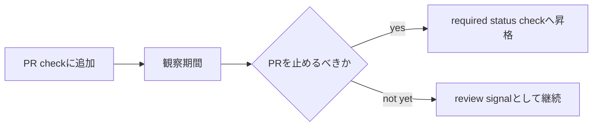

## 対象読者

- GitHub Actions のチェックを branch protection の required status check に入れるか迷っている人
- TFLint / Gitleaks / Trivy などの品質ゲートを PR に入れたが、どこまで merge blocking にするか悩んでいる人
- 「CI を増やしたら安全になる」は本当か、運用目線で考えたい人

この記事で扱うのは、ツール導入そのものではなく、**どのチェックで PR を止めるかを設計する判断基準**です。

## 先に結論

GitHub Actions の job を追加することと、その job を required status check にすることは別の設計判断です。

今回は、PR 品質ゲートとして追加した `TFLint` / `Gitleaks Secret Scan` / `Trivy Config Scan` を約1週間観察し、次の判断にしました。

| Check | 観察結果 | 判断 |
|---|---:|---|
| `TFLint` | 54 / 54 success、平均19秒 | required にする |
| `Gitleaks Secret Scan` | 54 / 54 success、平均23秒 | required にする |
| `Trivy Config Scan` | 54 / 54 success、平均19秒 | required にしない |

`Trivy Config Scan` は green でしたが、`exit-code: 0` で動かしているため、HIGH / CRITICAL の finding があっても job は失敗しません。
つまり、required にしても「検出内容で PR を止める gate」にはなりません。

大事だったのは、「required にするかどうか」をツール名で決めないことでした。
見るべきなのは、少なくとも次の5つです。

- 検出したときに PR を止めるべき性質か
- false positive や accepted risk が整理済みか
- 実行時間と安定性が日常運用に耐えるか
- 失敗時に誰が何を直せばよいか明確か
- branch protection の戻し方まで docs に残っているか

## 前提

運用コンテキストは次の通りです。

| 観点 | 内容 |
|---|---|
| チーム規模 | 個人開発に近い少人数運用 |
| 対象 | AWS / Terraform を含むポートフォリオ用の dev 中心プロジェクト |
| 実行者 | リポジトリ管理者本人 |
| 変更対象 | GitHub branch protection と PR チェックの運用 docs |
| 失敗時の影響 | PR が merge できなくなる。AWS リソースには直接影響しない |
| 権限境界 | GitHub repository settings を変更できる権限が必要 |

:::message
この記事は 2026年5月時点の実装と GitHub Actions の挙動をもとにしています。
Terraform apply / AWS リソース変更の話ではありません。
:::

## 用語を分ける

まず、ここを分けないと話が混ざります。

| 用語 | この記事での意味 |
|---|---|
| job | GitHub Actions workflow の中の実行単位。例: `TFLint`, `Gitleaks Secret Scan` |
| status check | PR 上に表示されるチェック結果 |
| required status check | branch protection で merge 条件に設定した status check。successful・skipped・neutral が通過条件 |
| job fail | job が失敗して赤くなること |
| finding | スキャンツールが見つけた指摘事項 |
| severity | finding の重大度。例: `HIGH`, `CRITICAL` |

GitHub の protected branch では、required status check が merge 条件になります。
一方で、GitHub Actions の job を作っただけでは、まだ merge blocking ではありません。

https://docs.github.com/en/repositories/configuring-branches-and-merges-in-your-repository/managing-protected-branches/about-protected-branches

https://docs.github.com/en/pull-requests/collaborating-with-pull-requests/collaborating-on-repositories-with-code-quality-features/about-status-checks

## 追加した品質ゲート

PR チェックには、既存の `Terraform Format & Validate` に加えて、次の3つを追加しました。

| Job | ツール | 目的 | 初期状態 |
|---|---|---|---|
| `TFLint` | `tflint` | Terraform / AWS provider 向け lint | 検出時 fail |
| `Gitleaks Secret Scan` | `gitleaks` | Git 履歴の secret 検出 | 検出時 fail |
| `Trivy Config Scan` | `trivy config` | IaC / Dockerfile などの設定ミス検出 | finding があっても fail しない |

最初は「PR 上で自動実行するが、branch protection には入れない」状態で観察しました。
その後、false positive、実行時間、PR 運用への影響を見て、required 化するものを選びました。



## 評価軸

今回の判断では、次の評価軸を置きました。

| 評価軸 | 見ること |
|---|---|
| Failure Mode | 落ちたとき、PR を止めるべき種類の失敗か |
| Actionability | 失敗した人が次に何を直せばよいか明確か |
| Noise | false positive や accepted risk が未整理のまま混ざっていないか |
| Runtime | 日常 PR の待ち時間として許容できるか |
| Recoverability | 誤って required にしても戻し方が明確か |

この評価軸を置くと、「セキュリティ系だから全部 required」という判断を避けられます。
セキュリティ系でも、secret 混入のように即ブロックしたいものと、IaC の設計判断を含むものでは扱いが違います。

## 判断フロー

同じような品質ゲートを設計するときは、この順で考えると決めやすいです。

1. **fail と required を分ける** — まず job fail だけで観察し、required 昇格は後から判断する
2. **ツール名ではなく検出内容で決める** — secret 混入は merge 前に止めるべき。accepted risk 未整理の IaC finding はまず整理が先
3. **観察期間を置く** — 成功率・実行時間・失敗原因を確認してから required にする。「false positive がゼロ、かつ失敗したときに誰が何を直すべきかが説明できる」状態が判断ラインの目安
4. **required にしない理由も docs に残す** — 「required にしなかった = 重要でない」の誤解を防ぐ

以下は、この軸とフローを TFLint / Gitleaks / Trivy に当てはめた結果です。

## required にしたもの：TFLint / Gitleaks

**TFLint** は Terraform / AWS provider 向けの lint です。非推奨設定、未使用宣言、provider 固有のミスは actionability が高く、PR 時点で止める価値があります。

**Gitleaks** は Git 履歴の secret を検出します。secret は履歴に入った時点でローテーション・無効化が必要になる可能性があるため、「あとで直す」では遅く、検出時点で blocking すべき性質が強いです。

観察期間中の結果はどちらも安定していました。

| Job | 実行結果 | 平均実行時間 | 最大実行時間 |
|---|---:|---:|---:|
| TFLint | 54 / 54 success | 19秒 | 26秒 |
| Gitleaks Secret Scan | 54 / 54 success | 23秒 | 27秒 |

評価軸でみると、Failure Mode（止めるべき種類の失敗か）・Actionability（誰が何を直すか明確か）・Runtime（待ち時間として許容できるか）の3軸が揃っていました。false positive による運用詰まりもなく、required にする価値が運用コストを上回ると判断しました。

## Trivy は required にしなかった

`Trivy Config Scan` は観察期間中 54 / 54 success でしたが、「指摘事項がゼロだった」という意味ではありません。

設定は次のようにしていました。

```yaml
- name: Run Trivy config scan
  uses: aquasecurity/trivy-action@v0.36.0
  with:
    scan-type: config
    scan-ref: .
    scanners: misconfig
    severity: HIGH,CRITICAL
    exit-code: '0'
    output: trivy-config.txt
```

`exit-code: '0'` は、finding が見つかっても job を失敗させない設定です。`output: trivy-config.txt` は結果をファイルに書き出すだけで、それ単体では artifact 化も PR 画面への表示もされません。確認するには、後続 step で `$GITHUB_STEP_SUMMARY` への書き出しや `actions/upload-artifact` による artifact 化を別途設定する必要があります。finding があっても PR を止めないため、これは intentionally non-blocking な review signal です。

Failure Mode の観点では、exit-code: 0 のままでは「落ちたとき PR を止めるべき種類の失敗」が起きないため、required にしても gate として機能しません。

https://github.com/aquasecurity/trivy-action

今回のスキャンでは、たとえば次のような finding が残っていました。

- 旧 CloudFormation 資産の指摘
- Dockerfile の root user
- CloudFront の WAF 無効化
- KMS / CMK 関連の暗号化指摘
- CloudTrail / Athena / SNS 周辺の暗号化指摘

これらはすべて「見なくてよい」という意味ではありません。
Noise の観点では、accepted risk と旧資産の finding が混在したまま blocking にすると、修正すべき finding と意図的に残した finding の区別がつかなくなります。`exit-code: 1` + required にすると、具体的に次の問題が起きます。

| 問題 | 何が起きるか |
|---|---|
| accepted risk 未整理 | 意図的に残している設計まで毎回 PR を止める |
| 旧資産の混入 | 現行構成ではないファイルの finding で日常 PR が止まる |
| ignore 理由が不明 | なぜ無視してよいかを後から説明できない |
| `exit-code: 0` のまま required | green なのに「セキュリティ gate が効いている」と錯覚する |

ここで required にすると、厳しくしたように見えて、実際には運用の意味が曖昧になります。
なので今回は、Trivy を review signal として残し、blocking 化は accepted risk / ignore 整理の後に回しました。

将来 required にするなら、①accepted risk の棚卸し → ②ignore 理由の docs 化 → ③scan scope 整理（旧資産の除外など）→ ④`exit-code: 1` への切り替え → ⑤branch protection 更新、の順で進める。この手順を踏んで初めて「green = 意味のある gate」になります。

## 「全部 required」案を採用しなかった

| 案 | Strength | Limitation | Why Not Adopted |
|---|---|---|---|
| 3job すべて required | 設定が単純。PR 画面上は厳しく見える | Trivy は `exit-code: 0` では finding を理由に止まらない | 「required なのに検出で止まらない」状態になり、意図が曖昧になる |
| Trivy を `exit-code: 1` にして即 required | HIGH / CRITICAL finding で確実に止められる | accepted risk / ignore 整理が先に必要 | 既存 finding で日常 PR が止まり、修正対象と例外の区別がつかない |
| 3job とも required にしない | 運用詰まりは最小 | secret や lint の明確な問題も merge できてしまう | Gitleaks / TFLint は止める価値が高く、観察結果も安定していた |

required は強い設定です。
強い設定ほど、「何を守るために強くしているのか」を説明できる必要があります。

## required 化で見落としやすい落とし穴

**workflow failure と job failure を混同しない**

観察期間中、`PR Check` workflow 全体としては failure がありました。ただし失敗していたのは `Terraform Plan Artifact` であり、今回 required 化を判断していた3jobではありませんでした。required 化を判断するときは、workflow 単位ではなく job 単位で見る必要があります。

**skipped と required の関係**

GitHub Actions では、job が skipped になったときと、path filtering などで workflow 自体が起動しないときの扱いが違います。workflow が skipped されると関連 check が pending のままになり、required だと merge を止める場合があります。

https://docs.github.com/en/actions/how-tos/manage-workflow-runs/skip-workflow-runs

`Terraform Plan Artifact` は docs-only PR では skip される設計でした。skip を吸収する gate job が必要になる論点があり、今回の主題ではないため required に含めませんでした。

**複数 workflow で同じ job name を持つと required check が曖昧になる**

GitHub の required status check は job name で識別します。複数の workflow に同じ名前の job が存在すると、どの workflow の結果を待てばよいかが曖昧になります。required に追加するときは、job name がリポジトリ内で一意かを確認してください。

## branch protection は Git の diff に残らない

Recoverability の観点では、誤って required にしたときに戻せるかどうかが問題になります。

workflow の YAML や docs は PR の diff に残ります。しかし、GitHub repository settings の required status checks は、変更しても Git の履歴には残りません。

そのため、設定変更と同じ PR で次を docs に残しました。

- 何を required にしたか / しなかったか、その理由
- 実設定の確認コマンド
- ロールバックコマンド

確認コマンドは次のようにしました。

```bash
gh api repos/OWNER/REPO/branches/main/protection/required_status_checks \
  --jq '{strict, contexts}'
```

戻すときは、`contexts` から該当 check を外して更新します。
実運用では、現在の設定を取得してから差分適用するほうが安全です。

```bash
jq -n '{
  strict: false,
  contexts: [
    "PR Policy Check",
    "Backend Lint & Build",
    "Frontend Build",
    "Terraform Format & Validate",
    "Commitlint"
  ]
}' \
  | gh api --method PATCH \
      repos/OWNER/REPO/branches/main/protection/required_status_checks \
      --input -
```

https://docs.github.com/en/rest/branches/branch-protection

:::message alert
PR を revert しても、GitHub の branch protection 設定は自動では戻りません。
Git 管理外の設定を変えた場合は、確認方法と戻し方を docs に残しておく必要があります。
:::

## 最終形

最終的な required status checks は次の形にしました。

```text
PR Policy Check
Backend Lint & Build
Frontend Build
Terraform Format & Validate
Commitlint
Gitleaks Secret Scan
TFLint
```

`Trivy Config Scan` は required に入れていません。ただし、PR check として引き続き実行し、HIGH / CRITICAL finding を review signal として見ます。

## まとめ

required status check は便利な仕組みですが、required すりゃいいってもんじゃないです。
PR を止めるということは開発者の手を止めるということです。

- `TFLint` は IaC lint として required にする
- `Gitleaks` は secret 混入を防ぐため required にする
- `Trivy` は accepted risk / ignore 整理が終わるまで review signal にする

どこで止めるかを設計し、止めないものにも理由を残す。そのほうが長く回せる CI/CD になります。
