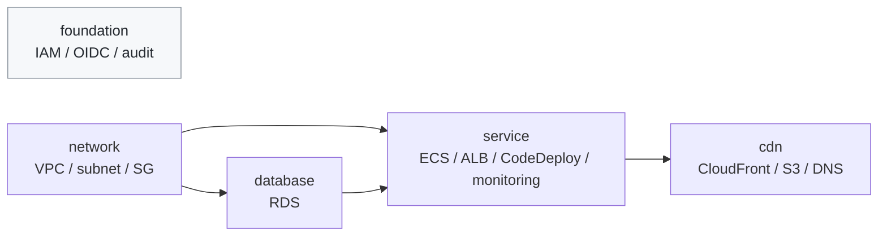
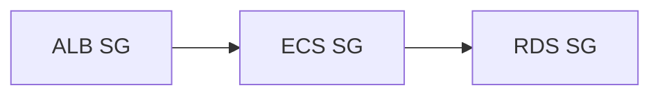

Terraform の root module / state をどこで分けるかは、単純そうで難しい判断です。

小さいうちは 1 state で十分です。ところが VPC、RDS、ECS、ALB、CodeDeploy、CloudFront まで同じ state に入ってくると、ECS の task definition を触りたいだけなのに、環境全体を毎回 plan / apply の文脈に乗せることになります。

この記事では、`terraform-hannibal` で `terraform/environments/dev/` の単一 state を、`network` / `database` / `service` / `cdn` の 4 state に分割したときの判断を書きます。

主題は「4分割が正解」という話ではありません。
読者が自分の環境で、**1 state のままでよいのか、2 state で十分なのか、責務単位で分けるべきなのか**を判断できるようにすることです。

:::message
この記事は 2026-06-25 時点の実装をもとにしています。
対象リポジトリの Terraform は `required_version = ">= 1.11.0"`、GitHub Actions では Terraform 1.12.1、手元確認では Terraform 1.14.8 を使っています。

対象は個人開発に近い少人数運用の dev 環境です。本番共有環境では、承認、state migration、ロールバック、権限分離をより厳密に設計してください。
:::

## 対象読者

- Terraform の state が大きくなり、どこで分けるべきか迷っている人
- `terraform_remote_state` を使った state 間依存を設計したい人
- 「module ごとに state を分ければよいのでは？」と思ったが、apply 順序や循環依存が気になっている人

この記事では、Terraform の書き方そのものより、**state 境界の引き方**を扱います。

## 先に結論

今回の結論は、module 数ではなく責務で state を分けることでした。

| state | 扱うもの | 分けた理由 |
|---|---|---|
| `foundation` | IAM / OIDC / CloudTrail / Athena / Budgets | アプリ環境より長生きする基盤。すでに別 state |
| `network` | VPC / subnet / route table / ALB/ECS/RDS Security Group | 他 state の土台。上位から参照される側 |
| `database` | RDS PostgreSQL / DB subnet group | lifecycle と変更リスクが service と異なる |
| `service` | ECS / ALB / CodeDeploy / monitoring / ECS IAM Role | 一緒に変わるアプリ実行系をまとめる |
| `cdn` | CloudFront / S3 frontend / Route53 DNS record | edge / frontend 側として service から分離できる |

判断軸は3つです。

1. **lifecycle が違うものを分ける**
2. **依存方向を一方向にできるものを分ける**
3. **一緒に変わるものは同じ state に残す**

この3つを同時に見ると、1 state は大きすぎ、module ごとの 9 state は細かすぎました。
このプロジェクトでは、4 state が分離の利点と運用コストのバランスがよい落としどころでした。

## 運用コンテキスト

同じ Terraform 構成でも、運用コンテキストが違うと正解は変わります。今回の前提は次の通りです。

| 観点 | 内容 |
|---|---|
| チーム規模 | 個人開発に近い少人数運用 |
| 対象環境 | `dev` 中心。通常は destroy 済みで、必要なときだけ起動 |
| 実行者 | GitHub Actions の手動 workflow、または管理者による Terraform 操作 |
| 権限境界 | GitHub Actions OIDC / deploy Role / foundation Role / PR plan Role を分離 |
| 失敗時の影響 | dev 環境の再作成・破棄に影響。foundation は日常 deploy / destroy から分離 |
| コスト方針 | 常時起動ではなく、オンデマンド起動 / 通常 destroy |

この前提では、常時稼働する本番環境よりも「再作成できること」と「誤って広い範囲を変更しないこと」を重視しています。

## 用語を先にそろえる

この記事では、次の意味で使います。

| 用語 | 意味 |
|---|---|
| root module | `terraform init/plan/apply` を実行する単位。backend と state を持つ |
| child module | root module から `module` block で呼び出される再利用単位 |
| state | Terraform が実リソースと設定の対応を保存する状態ファイル |
| blast radius | 変更や失敗が影響しうる範囲 |
| `terraform_remote_state` | 別の state の root output を読む Terraform data source |

HashiCorp のドキュメントでも、remote state は構成を小さな単位に分解し、たとえば network 側が VPC ID や subnet ID を output として公開し、他の構成が読む用途として説明されています。

https://developer.hashicorp.com/terraform/language/state/remote

ただし `terraform_remote_state` には注意点があります。output だけを読むように見えても、利用者には state snapshot へのアクセス権が必要になります。機密値を含む state では、SSM Parameter Store など別の公開先を使う判断も必要です。

https://developer.hashicorp.com/terraform/language/state/remote-state-data

## 変更前: 1 state に環境全体が入っていた

変更前は、`terraform/environments/dev/` がアプリ環境全体を持っていました。

```text
terraform/environments/dev/
  VPC
  RDS
  ECS
  ALB
  CodeDeploy
  CloudFront
  S3 frontend
  Route53
  monitoring
```

この構成は最初から悪かったわけではありません。
小さいうちは、1つの root module で全体を見られる方が簡単です。apply 順序も考えなくて済みます。

このプロジェクトでも、最初は `dev` が1環境だけで、起動も停止も「環境全体」を対象にする運用でした。
その段階では、VPC、RDS、ECS、CloudFront をまとめて作れることの方が重要で、state 境界を細かく分ける理由は弱かったです。

1 state がつらくなったのは、アプリ実行系、DB、edge 側を同じ cadence で扱えなくなり、日常 deploy / destroy から切り離す foundation との境界も明確になってきてからです。
つまり「1 state が間違っていた」のではなく、構成が育って state の役割が変わりました。

しかし、構成が増えるにつれて次の問題が出ます。

| 課題 | 何が困るか |
|---|---|
| plan 対象が広い | ECS だけを触りたいのに VPC / RDS / CloudFront まで評価される |
| apply の影響範囲が広い | 予期しない差分が出たとき、環境全体が blast radius になる |
| state lock が太い | 複数人や複数 workflow が同じ state を触ると直列化する |
| module 責務が混ざる | Security Group / IAM / Target Group の所有者が実際の利用者とずれる |

ここで重要なのは、state 分割が目的ではないことです。
目的は、**変更したい範囲だけを plan / apply の主語にすること**です。

## 評価軸

候補を比べる前に、評価軸を決めました。

| 評価軸 | 見ること |
|---|---|
| Lifecycle | 起動・破棄・永続化の単位が同じか |
| Change Frequency | 変更頻度が近いか |
| Dependency Direction | state 間依存を一方向にできるか |
| Apply Cohesion | 一緒に変わるリソースが同じ state に残るか |
| Operational Overhead | root module 数、apply 順序、remote state 参照が増えすぎないか |
| Recoverability | state migration や rollback の手順を書けるか |

この評価軸を置くと、「細かく分けるほどよい」とは言えなくなります。
分けるほど blast radius は小さくなりますが、apply 順序と state 間参照の管理コストは増えます。

## 採用しなかった選択肢

比較した候補のうち、採用しなかったのは次の3案です。

| 案 | Strength | Limitation | Why Not Adopted |
|---|---|---|---|
| 1 state のまま | 構成が単純。apply 順序を考えなくてよい | plan / apply の blast radius が環境全体に広がる | ECS や CloudFront の変更まで環境全体の文脈に乗るため、成長後の運用には重い |
| 2 state: `network` + `app` | 分割が少なく移行しやすい | RDS / ECS / CloudFront が同じ state に残る | database と service の lifecycle / 変更リスクを分けきれない |
| module ごとの 9 state | blast radius は最小に近い | `terraform_remote_state` と apply 順序が増え、循環依存も起きやすい | ECS / ALB / CodeDeploy / monitoring は一緒に変わるため、分けるほど運用が複雑になる |

一番迷いやすいのは、module ごとの state 分割です。

Terraform の child module はコードの再利用・責務整理の単位です。一方、state は実行・ロック・変更影響の単位です。
この2つを同じ粒度にすると、一緒に変わるリソースまで別々に apply することがあります。

## 採用した構成

最終的には、次の依存方向にしました。



矢印は「右側が左側の output を読む」という意味です。
`foundation` は IAM / OIDC / 監査などの永続基盤なので、日常の deploy / destroy 順序には入れません。

## 実装ポイント1: 下位 state は root output だけ公開する

`network` は、上位 state が必要とする値を root output として公開します。

```hcl
output "vpc_id" {
  value = module.vpc.vpc_id
}

output "app_subnet_ids" {
  value = module.vpc.app_subnet_ids
}

output "rds_security_group_id" {
  value = module.vpc.rds_security_group_id
}
```

`database` は `network` state を読みます。実際の記事用には bucket 名を伏せています。

```hcl
data "terraform_remote_state" "network" {
  backend = "s3"

  config = {
    bucket = "<state-bucket>"
    key    = "network/terraform.tfstate"
    region = "ap-northeast-1"
  }
}

module "rds" {
  source = "../modules/rds"

  data_subnet_ids       = data.terraform_remote_state.network.outputs.data_subnet_ids
  rds_security_group_id = data.terraform_remote_state.network.outputs.rds_security_group_id
}
```

ここで守るべきことは、参照方向を戻さないことです。
`database` が `network` を読むのはよいですが、`network` が `database` を読むと循環します。

## 実装ポイント2: Security Group は network state に寄せた

最初は、Security Group を ALB / ECS / RDS の各 module に持たせる案も考えられます。
一見その方が自然です。ALB の SG は ALB module、ECS の SG は ECS module、RDS の SG は RDS module、という分け方です。

しかし、この構成では SG 間の参照が state をまたぎやすくなります。



ECS は ALB からの inbound を許可し、RDS は ECS からの inbound を許可します。
SG を各 module / state に分散すると、`service` と `database` と `network` の間に細かい remote state 参照が増えます。

今回の構成では、ALB / ECS / RDS の Security Group を VPC module にまとめ、`network` state の output として公開しました。

```text
network state
  VPC
  subnet
  route table
  ALB Security Group
  ECS Security Group
  RDS Security Group
```

これは「VPC module がすべてのセキュリティ設計を所有すべき」という一般論ではありません。
このプロジェクトでは、SG 間の相互参照を `network` state 内に閉じることで、state 間依存を一方向に保つための判断です。

## 実装ポイント3: ECS / ALB / CodeDeploy / monitoring は分けなかった

細かく分けたくなる箇所がもう1つあります。
ECS、ALB、CodeDeploy、monitoring です。

これらを別 state にすると、見た目の責務はきれいになります。
しかし、実際の変更では一緒に動きます。

| リソース | なぜ一緒に変わりやすいか |
|---|---|
| ECS | task definition / service / target group と連動する |
| ALB | listener / target group / health check が ECS と連動する |
| CodeDeploy | ECS service、blue/green target group、listener を参照する |
| monitoring | ECS / ALB / RDS の alarm 名や ARN を参照する |

特に CodeDeploy は、ALB の target group pair と monitoring の alarm を使います。
ここを分けすぎると、1つのデプロイ設計を変更するだけで複数 state の apply が必要になります。

そのため、アプリ実行系は `service` state にまとめました。

```text
service state
  ECS
  ALB
  CodeDeploy
  monitoring
  ECS task execution IAM Role
```

「分けられるか」だけでなく、「一緒に変わるか」を見るのが大事でした。

## 実装ポイント4: deploy / destroy の順序も設計対象になる

state を分けると、apply 順序が設計対象になります。

今回の deploy 順序は次の通りです。

```text
network -> database -> service -> cdn
```

destroy は逆順です。

```text
cdn -> service -> database -> network
```

GitHub Actions の deploy workflow もこの順序に合わせました。

```yaml
- name: Deploy Infrastructure (network)
  working-directory: ./terraform/network
  run: terraform apply -auto-approve tfplan

- name: Deploy Infrastructure (database)
  working-directory: ./terraform/database
  run: terraform apply -auto-approve tfplan

- name: Deploy Infrastructure (service)
  working-directory: ./terraform/service
  run: terraform apply -auto-approve tfplan

- name: Deploy Infrastructure (cdn)
  working-directory: ./terraform/cdn
  run: terraform apply -auto-approve tfplan
```

ここを曖昧にすると、`service` が `network` の output を読む前に `network` が存在しない、という失敗になります。
state 分割はディレクトリを分けて終わりではなく、CI/CD の実行順序まで含めて完了です。

## 検証したこと

実装 PR では、AWS リソースの state migration は含めず、root module と module 責務整理、CI/CD 順序、移行ガイドを追加しました。
既存リソースを移す `terraform state mv` は、人間の監督下で実施する手順として分離しました。

PR 上では、次を確認しています。

| 段階 | 確認内容 | 結果 |
|---|---|---|
| 静的検証 | `terraform fmt -check -recursive` | pass |
| root module 検証 | `foundation` / `network` / `database` / `service` / `cdn` の `init -backend=false` と `validate` | pass |
| lint | TFLint | pass |
| workflow | deploy は `network -> database -> service -> cdn`、destroy は逆順に変更 | PR で反映 |

`terraform_remote_state` は実 backend の output を読むため、`init -backend=false && validate` だけでは「実 state に output が存在するか」までは確認できません。
これは state 分割後の重要な注意点です。

分割後に「正しく動いている」と判断するには、静的検証とは別に実 state を読む確認が必要です。
この構成なら、少なくとも次を完了条件にします。

| 確認 | 何を見るか |
|---|---|
| `network` apply 後の output | `vpc_id` / subnet IDs / SG IDs が root output として出るか |
| `database` plan / apply | `network` の output を読んで RDS plan が作れるか |
| `service` plan / apply | `network` と `database` の output を読んで ECS / ALB / CodeDeploy の plan が作れるか |
| `cdn` plan / apply | `service` の ALB output と origin verify header を読めるか |
| destroy | `cdn -> service -> database -> network` の逆順で依存エラーなく消せるか |

特に `terraform_remote_state` を使う構成では、`validate` が通っても実 state の output 不足で plan が失敗することがあります。
そのため、静的検証は「Terraform として読める」確認、実 state を読む plan / apply は「分割境界が運用できる」確認として分けて扱います。

実 state を読む plan や apply は、環境が destroy 済みか、上流 state に output が存在するかによって挙動が変わります。
この論点は PR plan artifact の設計にも波及したため、別の設計判断として扱いました。

## state migration はコード変更とは別の作業にした

既存 state を分割する場合、設定ファイルを移動するだけでは足りません。
既存リソースの state address を新しい state へ移す必要があります。

たとえば、Security Group を旧 `module.security_groups` から新 `module.vpc` へ移す場合、resource address も変わります。

```bash
terraform state mv \
  -state=old.tfstate \
  -state-out=network.tfstate \
  module.security_groups.aws_security_group.ecs \
  module.vpc.aws_security_group.ecs
```

HashiCorp の refactor state ドキュメントにもあるように、state を直接扱う作業はリスクがあります。

https://developer.hashicorp.com/terraform/language/state/refactor

そのため、この PR では state migration を自動実行せず、移行ガイドに分けました。
少なくとも次を満たしてから実行する前提にしています。

- state backup を取る
- 旧 state と新 state を同時に apply しない
- `terraform state mv` の address 対応をレビューする
- 移動後に plan で意図しない再作成がないことを確認する
- 失敗時に戻す手順を用意する

state 分割の設計と、既存 state の移行作業は、同じ PR に詰め込むほど危険になります。
設計・コード変更・state 操作を分けることで、レビューする観点も分けられます。

## 危なかったところ

実装ポイント2で書いた SG の配置は、最初からすんなり決まったわけではありません。
設計段階では一度、ALB SG は ALB module、ECS SG は ECS module、RDS SG は RDS module に寄せる方向で考えていました。

見直しのトリガーは、module 配置ではなく state 依存グラフに描き直したことです。
その時点で、SG を各 module に分けると `network` / `service` / `database` をまたぐ参照が増えることに気づきました。

```text
最初の見方: ALB SG は ALB module、RDS SG は RDS module
見直した観点: SG 相互参照を network state に閉じる
```

この見直しが遅れていたら、state 分割後に remote state 参照を増やすか、apply 順序を複雑にするかのどちらかを選ぶことになっていました。
Terraform では、child module の責務と state の責務がいつも一致するとは限りません。

## 判断チェックリスト

自分の環境で state を分けるか迷ったら、次の順で見ると判断しやすいです。

| 問い | Yes なら |
|---|---|
| 片方を変更しても、もう片方を plan / apply したくないか | state 分割候補 |
| lifecycle が違うか。片方だけ destroy / recreate されるか | state 分割候補 |
| 依存方向を一方向にできるか | 分割しやすい |
| 一緒に変わることが多いか | 同じ state に残す候補 |
| remote state の output に機密値が含まれるか | `terraform_remote_state` 以外の公開方法も検討 |
| deploy / destroy 順序を明文化できるか | 分割して運用可能 |
| rollback / state migration 手順を書けるか | 実施に進める |

迷ったときは、module 数ではなく「apply したい単位」で考えるのがよいです。
module はコードの境界、state は運用の境界です。

## 今回スコープ外にしたこと

この記事では、次を扱いません。

- PR plan artifact の再設計
- HCP Terraform / Terraform Cloud の workspace 設計
- 本番複数チームでの ownership 分割
- state migration の全コマンド一覧
- state 内の sensitive value をどう扱うかの詳細設計

特に PR plan artifact は、state 分割後に `terraform_remote_state` の output 有無とぶつかりやすい論点です。
destroy 済みが通常状態の環境では、上流 state に output が存在しないため、下流 state の plan が構造的に失敗することがあります。

これは「state 分割が悪い」のではなく、「PR でどの単位の plan を出すか」を別に設計する必要がある、という話です。

## まとめ

Terraform state の分割は、ディレクトリ整理ではなく運用境界の設計です。

分割後の状態を見て「きれいに分かれた」と感じても、deploy 順序、destroy 順序、remote state の権限、state migration の戻し方まで説明できなければ、運用できる境界にはなりません。

読者の環境では、2 state がちょうどよいかもしれませんし、サービス単位でもっと分ける方がよいかもしれません。
大事なのは state の数ではなく、「この単位で plan / apply / rollback したい」と説明できることです。
