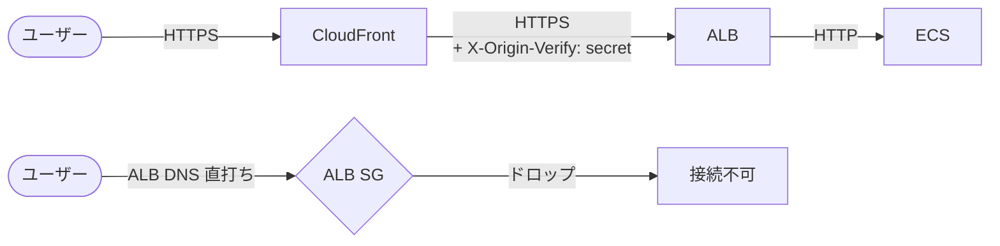

## はじめに

ポートフォリオ用 AWS 構成に Trivy Config（IaC セキュリティスキャン）を導入したところ、`aws_lb.main` の `internal = false`（internet-facing ALB）が検出されました。

この記事では、CloudFront + ALB 構成で Trivy の public ALB 検出に対応するときの**設計判断の軸**と**2段制限が必要になる理由**を整理します。

**対象読者:** Terraform で CloudFront + ALB 構成を運用していて、ALB への直接アクセスを制限したいと考えているエンジニア。

:::message
動作確認は Terraform 1.12.1 / AWS provider 6.x で行っています（2026年5月時点）。
:::

---

## 運用コンテキスト

| 項目 | 内容 |
|---|---|
| 規模 | 個人開発（1人） |
| 対象環境 | dev（deploy/destroy で管理。常時稼働なし） |
| 実行者 | GitHub Actions（OIDC → IAM Role assume） |
| 変更失敗時 | destroy → deploy で再構築可能 |
| 権限境界 | Permission Boundary 付き IAM Role |

---

## 先に結論

Trivyの検出をそのまま消すことが目的ではなく、origin接続方式・制限範囲・CI/CDとの整合性を見て対応を選ぶことになります。今回はdev / 小規模環境として、internet-facing ALBを維持しながら到達経路を絞る判断をしました。

| 判断軸 | 見ること | 今回の判断 |
|---|---|---|
| ALB を private 化できるか | CloudFront から private origin に到達できる構成か | custom origin のため見送り |
| SG だけで足りるか | CloudFront 全体を許容してよいか | 不十分 |
| distribution 単位で絞るか | 他アカウント CloudFront 経由を防ぎたいか | custom header を併用 |
| CodeDeploy と競合しないか | default_action を動的変更するか | explicit deny rule にする |

### 変更前後

| 箇所 | Before | After |
|---|---|---|
| ALB SG ingress | `0.0.0.0/0`（80 / 443 / 8080） | CloudFront managed prefix list（TCP 80-8080） |
| CloudFront API origin | custom header なし | `X-Origin-Verify: <secret>` を追加 |
| ALB listener rule（443 / 8080） | path pattern のみ | + header 一致条件を追加 |
| ALB listener rule priority 200 | なし | header なし → 403 の fallback deny |

**制限後の通信経路:**



---

## どう判断するか

制限は段階的に積み上げます。どこまで積むかを構成と要件に合わせて決めます。

**まずアーキテクチャを決める**
- ALBをprivate subnetに閉じる組織標準がある・本番相当のセキュリティ基準が必要: CloudFront VPC originsを含め、origin接続方式から設計する
- internet-facing ALBを維持する: 以下の段を積み上げる

**制限を積む**
- 1段目（原則必須）: CloudFront managed prefix listでSGをCloudFront IPに限定する。この時点では「AWS CloudFront全体」への制限
- 2段目（他アカウントのCloudFront経由も防ぐなら）: custom headerを追加して、期待するdistribution経由かをlistener層で確認する。1段目だけでは他アカウントのCloudFront経由が通ってしまう

**別レイヤで検討する**
- L7攻撃・bot対策が必要: WAFを別途検討する（この設計の対象外）
- CodeDeploy Blue/Greenを使っている: `default_action`ではなくexplicit listener ruleで制御する

---

## 選ばなかった構成：`internal = true`

Trivy の public ALB 検出を見たとき、最初に思いつく対応は `aws_lb.main.internal = true` です。しかし、CloudFront custom origin として public DNS のカスタムドメイン（`api.example.com`）を指定している今回の構成では採用できませんでした。

従来の custom origin として public DNS / public カスタムドメインを指定する構成では、CloudFront は internet-facing な origin に接続します。そのため、今回の構成のまま ALB だけを internal 化しても CloudFront から到達できません。internal ALB を使う場合は、**CloudFront VPC origins** など origin 接続方式から設計変更が必要です。

```hcl
# 今回は採用しなかった
resource "aws_lb" "main" {
  internal = true  # 今回の構成のまま ALB だけを internal 化すると CloudFront から到達できなくなる
}
```

---

## 選んだ構成：2段制限

2段にする理由を先に整理します。

- **SG**（1段目）: CloudFront origin-facing IP からの通信だけを通す。ネットワーク単位の制限
- **custom header**（2段目）: 期待する CloudFront distribution 経由かを listener 層で確認する。distribution 単位の制限

SG だけだと「AWS CloudFront 全体」への制限になり、他アカウントの CloudFront 経由も通ってしまいます。両段を組み合わせて初めて「このプロジェクトの distribution から来たか」まで確認できます。

### 1段目 SG：CloudFront 以外をネットワーク層でドロップ

```hcl
resource "aws_security_group" "alb" {
  ingress {
    description     = "ALB listeners from CloudFront origin-facing addresses"
    from_port       = 80
    to_port         = 8080
    protocol        = "tcp"
    prefix_list_ids = [var.cloudfront_origin_facing_prefix_list_id]
  }
}
```

### 2段目 custom header：distribution を特定する

**CloudFront 側（header を付加する）:**

```hcl
resource "aws_cloudfront_distribution" "main" {
  origin {
    custom_header {
      name  = var.alb_origin_verify_header_name
      value = var.alb_origin_verify_header_value
    }
    custom_origin_config {
      origin_protocol_policy = "https-only"
    }
  }
}
```

**ALB 側（要点抜粋。header 一致時だけ forward、なければ 403）:**

```hcl
resource "aws_lb_listener_rule" "production_https" {
  priority = 100
  action { type = "forward" ... }

  condition {
    path_pattern { values = ["/api/*", "/graphql"] }
  }
  condition {
    http_header {
      http_header_name = var.alb_origin_verify_header_name
      values           = [var.alb_origin_verify_header_value]
    }
  }
  lifecycle {
    ignore_changes = [action]  # CodeDeploy が動的に書き換えるため
  }
}

resource "aws_lb_listener_rule" "deny_without_origin_header" {
  priority = 200
  action {
    type = "fixed-response"
    fixed_response {
      content_type = "text/plain"
      message_body = "Access denied"
      status_code  = "403"
    }
  }
  condition {
    path_pattern { values = ["/*"] }
  }
}
```

**secret 値は `random_password` で生成します。** Git には保存しませんが、値は Terraform state に保持されるため、state backend のアクセス制御と暗号化を前提にします。ローテーションは `alb_origin_secret_rotation_version` を `v1` → `v2` に更新して apply するだけです。

```hcl
resource "random_password" "alb_origin_verify_header" {
  length  = 48
  special = false
  keepers = {
    rotation_version = var.alb_origin_secret_rotation_version
  }
}
```

### この設計で防ぐもの / 防がないもの

この構成で防ぎたいのは、一般インターネットからの ALB 直アクセスと、他アカウント CloudFront distribution 経由の到達です。一方で、L7 攻撃全般を防ぐ設計ではありません。WAF や bot 対策は別レイヤの判断として扱います。custom header はあくまで origin への到達経路を識別する制御であり、アプリケーション認証やWAFの代替ではありません。

---

## 実装のポイント

### SG rule quota と prefix list weight

CloudFront managed prefix list の **weight は 55** です。SG rule quota（default 60）を消費するため、80 / 443 / 8080 を個別 rule にすると weight が 165 になり quota を超えます。**TCP 80-8080 を1本にまとめます。**

```hcl
# OK：1本にまとめて weight 55 に収める
ingress {
  from_port       = 80
  to_port         = 8080
  prefix_list_ids = [var.cloudfront_origin_facing_prefix_list_id]
}
```

ポート 81-442、444-8079、8081 以降は ALB listener が存在しないため application traffic にはなりません。

### deny rule は explicit rule で

CodeDeploy Blue/Green は `default_action` を動的に書き換えて target group を切り替えます。`default_action` に 403 を設定すると Blue/Green が壊れます。priority 200 の explicit deny rule にすることで両立できます。

### prefix list ID は変数で渡す

:::message alert
`data "aws_ec2_managed_prefix_list"` を使うと、Terraform plan 実行時に `ec2:GetManagedPrefixListEntries` が必要になります。PR plan 専用 Role にこの権限がないと CI が失敗します。

```
Error: not authorized to perform: ec2:GetManagedPrefixListEntries
```

data source を削除し、prefix list ID を変数で渡すと plan role の権限追加なしで CI を通せます。
:::

```hcl
# ap-northeast-1 の ID を渡す例
module "security_groups" {
  cloudfront_origin_facing_prefix_list_id = "pl-58a04531"
}
```

prefix list ID はリージョンごとに異なります。`aws ec2 describe-managed-prefix-lists --filters Name=prefix-list-name,Values=com.amazonaws.global.cloudfront.origin-facing` で確認できます。

---

## 検証

| 確認項目 | 結果 |
|---|---|
| `https://example.com` → 200 OK | ✅ |
| `https://example.com/graphql` → 200 OK | ✅ CloudFront → ALB header 一致で通る |
| ALB DNS 直打ち（HTTPS / HTTP） → 接続不可 | ✅ SG でドロップ |

`/graphql` の確認は「forward 側のルールが機能しているか」の検証です。ブロック確認だけでは、custom header の条件が誤って全リクエストを 403 にしていても気づけません。

---

## 適用条件

この設計は、CloudFront + internet-facing ALB を維持しつつ ALB 直アクセスを制限したい dev / 小規模環境に向いています。本番の高リスク API、L7 攻撃対策が必要な環境、ALB を private subnet に閉じる組織標準がある環境では、WAF や CloudFront VPC origins も含めて再設計します。

---

## 残課題と accepted risk

| 項目 | 状態 | 理由 |
|---|---|---|
| PR plan role への `ec2:GetManagedPrefixListEntries` 追加 | 別 Issue | foundation IAM 変更のため別途対応 |
| `aws_lb.main.internal = true` + CloudFront VPC origins | 別 Issue | dev 環境では優先度低。本番相当では検討 |
| WAF | accepted risk | 月額固定費が発生するため別途判断 |

---

## おわりに

Trivy の public ALB 検出は「internal にする/しない」の二択ではありません。CloudFront origin の接続方式・SG の制限範囲・distribution の識別・CI/CD との整合性を組み合わせて設計判断します。

「どこまで防ぎたいか」「今の構成で何が前提になっているか」が決まれば、どの段で何を絞るかが見えてきます。

### 参考リンク

https://docs.aws.amazon.com/AmazonCloudFront/latest/DeveloperGuide/restrict-access-to-load-balancer.html

https://docs.aws.amazon.com/AmazonCloudFront/latest/DeveloperGuide/add-origin-custom-headers.html

https://docs.aws.amazon.com/vpc/latest/userguide/working-with-aws-managed-prefix-lists.html
